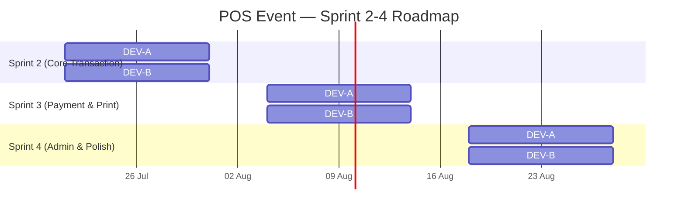
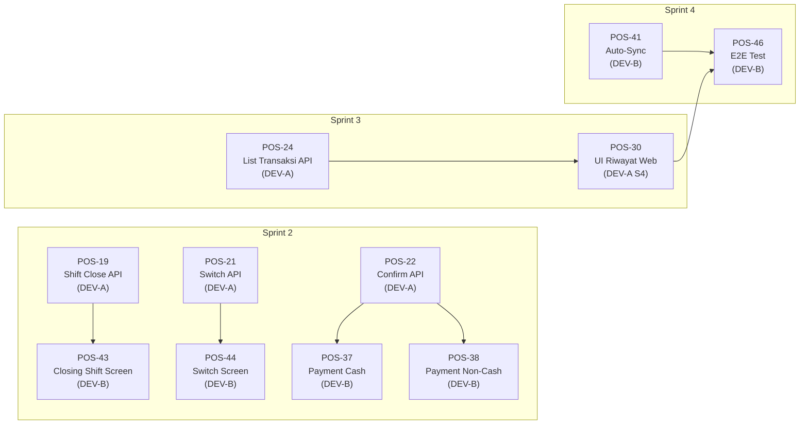

# 📋 Rencana Kerja & Tiket Jira — POS Event System
## Sprint 2–4 | Selaras dengan PRD v1.0-Sprint1

> **Disusun oleh**: Lead Technical Project Manager (AI-Assisted)
> **Tanggal**: 21 Juli 2026
> **Acuan Utama**: [PRD_POS_Event_v1.0.md](file:///d:/laragon/www/posevent_app/PRD_POS_Event_v1.0.md)
> **Baseline**: Sprint 1 telah selesai (~54% overall progress)

> [!IMPORTANT]
> Dokumen ini memperluas rencana kerja 2 minggu sebelumnya (DEV-A.pdf & DEV-B.pdf) menjadi **3 Sprint tambahan (Sprint 2–4)** agar menutupi 100% backlog PRD. Setiap Sprint berdurasi **2 minggu (10 hari kerja)**.

---

## 📊 Ringkasan Eksekutif

### Baseline Sprint 1 (Sudah Selesai)

| Komponen | Done | Backlog | Progress |
|----------|------|---------|----------|
| Backend API (Laravel) | 12 endpoint | 6 endpoint | ~67% |
| Web Admin (Blade) | 1 view (login) + 1 partial (dashboard) | 6 view | ~19% |
| Mobile Kasir (RN) | 2 screen (login, shift) | 6 screen | ~25% |
| Database Schema | 20 migrasi | 0 | 100% |
| **TOTAL** | **20 fitur** | **18 fitur** | **~54%** |

### Target Setelah Sprint 4

| Komponen | Target | Progress |
|----------|--------|----------|
| Backend API | 18/18 endpoint (100%) | ████████████████████ |
| Web Admin | 8/8 view (100%) | ████████████████████ |
| Mobile Kasir | 8/8 screen (100%) | ████████████████████ |
| Integrasi HW | Printer + Auto-Sync | ████████████████████ |
| **TOTAL** | **39/39 fitur (100%)** | ████████████████████ |

### Timeline Overview

---

# 🔵 DEVELOPER A — Backend & Web Admin

## Profil Peran

| Aspek | Detail |
|-------|--------|
| **Nama Kode** | DEV-A |
| **Tanggung Jawab** | Backend API (Laravel + Sanctum) & Web Admin UI (Blade + Tailwind) |
| **Tech Stack** | PHP 8.2, Laravel 11, MySQL 8.0, Blade, Tailwind CSS v3, Vite |
| **Repository** | `pos-event-backend/` |

---

## 🗓️ Sprint 2 — Core Transaction API (Hari 1–10)

> **Goal Sprint**: Melengkapi seluruh API endpoint shift management & checkout flow yang masih BACKLOG, sehingga Mobile (DEV-B) bisa mengintegrasikan fitur inti transaksi.

### Jadwal Kerja Terperinci

| Hari | Tugas Utama | Detail Teknis |
|------|-------------|---------------|
| **Hari 1** | API `POST /shift/close` | Implementasi `ShiftSessionController@close`. Validasi shift aktif milik user, hitung ringkasan penjualan (total tunai, non-tunai, jumlah transaksi), terima input `uang_fisik_akhir`, kalkulasi `selisih_uang`, update `status_shift → CLOSED` + `waktu_selesai`. Gunakan `DB::transaction` atomic. Catat log di `shift_operator_logs`. |
| **Hari 2** | API `POST /shift/break` & `/shift/resume` | Implementasi `ShiftSessionController@break` & `resume`. Validasi status shift = `OPEN` → set `ON_BREAK` (break), atau `ON_BREAK` → set `OPEN` (resume). Catat `waktu_break` di `shift_operator_logs`. Cegah double-break. |
| **Hari 3** | API `POST /shift/switch` | Implementasi `ShiftSessionController@switch`. Validasi kasir pengganti (role=Kasir, status_aktif). Update `id_user_aktif` di `shift_session`. Catat operator lama & baru di `shift_operator_logs`. Sesi shift tetap sama, hanya operator yang berganti. |
| **Hari 4** | API `POST /checkout/{id}/confirm` | Implementasi `CheckoutController@confirmTransaction`. Validasi `status = 'Draft'`, update `status → 'Success'`. Catat `waktu_pembayaran`. Jika metode non-tunai, simpan detail ke `detail_pembayaran_non_tunai`. Gunakan `DB::transaction`. |
| **Hari 5** | API `POST /checkout/{id}/void` | Implementasi `CheckoutController@voidTransaction`. Validasi `status = 'Draft' atau 'Success'`, require field `alasan_batal` (wajib isi). Update `status → 'Void'`, catat `diperbarui_oleh`. Audit log entry. Kembalikan stok jika applicable. |
| **Hari 6** | API `GET /transaksi` (List + Filter) | Implementasi `TransaksiController@index`. Support filter: `id_shift`, `id_cabang`, `status`, `tanggal_mulai`, `tanggal_akhir`, `id_metode_pembayaran`. Pagination (15/page). Eager-load detail items + metode pembayaran. Middleware: `auth:sanctum`. Admin: semua transaksi. Kasir: hanya shift aktifnya. |
| **Hari 7** | API `GET /transaksi/{id}` (Detail) + Laporan Shift | Implementasi `TransaksiController@show` (detail lengkap). Implementasi `GET /shift/{id}/summary` untuk ringkasan penjualan per shift (total, per-metode, per-kategori). |
| **Hari 8** | Route Registration + Middleware Wiring | Daftarkan seluruh route baru di `api.php`. Pastikan middleware `auth:sanctum` dan `admin.only` sesuai RBAC matrix. Route kasir-only: shift/close, break, switch. Route shared: transaksi (dengan scope berbeda). |
| **Hari 9** | Unit & Feature Testing | Tulis test untuk: `ShiftCloseTest`, `ShiftBreakTest`, `ShiftSwitchTest`, `CheckoutConfirmTest`, `CheckoutVoidTest`, `TransaksiListTest`. Minimum 2 test case per endpoint (success + failure). Verifikasi idempotency dan RBAC. |
| **Hari 10** | Postman Collection Update + Bug Fix | Update koleksi Postman di `postman/` dengan seluruh endpoint baru. Environment variables. Dokumentasi request/response body. Fix bug dari hasil testing. |

### Tiket Jira Sprint 2 — DEV-A

---

#### POS-19: API Closing Shift (`POST /shift/close`)
| Field | Detail |
|-------|--------|
| **ID** | POS-19 |
| **Tipe** | Story |
| **Sprint** | Sprint 2 |
| **Assignee** | DEV-A |
| **Story Points** | 8 |
| **Label** | `backend`, `api`, `shift`, `P0` |
| **User Story** | *Sebagai Kasir, saya ingin menutup shift saya dengan memasukkan jumlah uang fisik di laci kas, agar sistem bisa menghitung selisih dan menyimpan rekonsiliasi.* |
| **Deskripsi** | Implementasi endpoint `POST /api/v1/shift/close` di `ShiftSessionController`. Endpoint menerima `uang_fisik_akhir` (numeric), menghitung ringkasan penjualan selama shift (query transaksi where `id_shift` & `status = Success`), menghitung `selisih_uang = uang_fisik_akhir - total_penjualan_tunai`, update `status_shift → CLOSED`, set `waktu_selesai = now()`. |
| **Acceptance Criteria** | |
| | ✅ Endpoint merespons `200 OK` dengan data shift yang telah ditutup termasuk ringkasan penjualan |
| | ✅ Field `uang_fisik_akhir` wajib diisi (required, numeric, min:0) |
| | ✅ Sistem menghitung otomatis: `total_transaksi`, `total_tunai`, `total_non_tunai`, `jumlah_struk` |
| | ✅ `selisih_uang` dihitung = `uang_fisik_akhir - total_penjualan_tunai_ekspektasi` |
| | ✅ Status shift berubah dari `OPEN` atau `ON_BREAK` → `CLOSED` |
| | ✅ `waktu_selesai` terisi timestamp saat close |
| | ✅ Log audit tercatat di `shift_operator_logs` dengan aksi `CLOSE` |
| | ✅ Menggunakan `DB::transaction` untuk atomicity |
| | ✅ Return 422 jika shift sudah `CLOSED` |
| | ✅ Return 403 jika user bukan pemilik shift aktif |
| **Referensi PRD** | `POS-4B`, Alur 4 (Section 5.2), Risk R-05 |
| **Dependency** | Bergantung pada `POS-5B` (confirm) agar ada transaksi `Success` yang dihitung |

---

#### POS-20: API Break/Resume Shift (`POST /shift/break`)
| Field | Detail |
|-------|--------|
| **ID** | POS-20 |
| **Tipe** | Story |
| **Sprint** | Sprint 2 |
| **Assignee** | DEV-A |
| **Story Points** | 5 |
| **Label** | `backend`, `api`, `shift`, `P2` |
| **User Story** | *Sebagai Kasir, saya ingin menjeda (break) dan melanjutkan (resume) shift saya, agar waktu istirahat tercatat tanpa menutup shift.* |
| **Deskripsi** | Implementasi dua aksi dalam satu endpoint `POST /api/v1/shift/break` dan `POST /api/v1/shift/resume` di `ShiftSessionController`. Break: validasi `status_shift = OPEN` → ubah ke `ON_BREAK`. Resume: validasi `status_shift = ON_BREAK` → ubah ke `OPEN`. |
| **Acceptance Criteria** | |
| | ✅ `POST /shift/break`: status `OPEN → ON_BREAK`, return 200 |
| | ✅ `POST /shift/resume`: status `ON_BREAK → OPEN`, return 200 |
| | ✅ Return 422 jika status tidak sesuai transisi (misal break saat sudah ON_BREAK) |
| | ✅ Catat `shift_operator_logs` dengan aksi `BREAK` / `RESUME` + timestamp |
| | ✅ Kasir hanya bisa break/resume shift miliknya sendiri |
| | ✅ Tidak bisa break jika shift sudah `CLOSED` |
| **Referensi PRD** | `POS-4C`, State Diagram Siklus Shift |

---

#### POS-21: API Switch Operator (`POST /shift/switch`)
| Field | Detail |
|-------|--------|
| **ID** | POS-21 |
| **Tipe** | Story |
| **Sprint** | Sprint 2 |
| **Assignee** | DEV-A |
| **Story Points** | 5 |
| **Label** | `backend`, `api`, `shift`, `P2` |
| **User Story** | *Sebagai Kasir, saya ingin menyerahkan shift ke kasir lain tanpa menutup shift, agar pergantian operator lebih cepat di jam sibuk.* |
| **Deskripsi** | Implementasi `POST /api/v1/shift/switch` di `ShiftSessionController`. Terima `id_user_baru` (kasir pengganti). Validasi kasir pengganti: role=Kasir, status_aktif=1, bukan user yang sama. Update `id_user_aktif` di `shift_session`. Catat operator lama & baru di `shift_operator_logs`. |
| **Acceptance Criteria** | |
| | ✅ `id_user_baru` wajib diisi, harus role=Kasir dan status_aktif |
| | ✅ Tidak boleh switch ke user yang sama |
| | ✅ `id_user_aktif` di shift_session di-update ke kasir baru |
| | ✅ `shift_operator_logs` mencatat: `user_lama`, `user_baru`, `aksi=SWITCH`, `timestamp` |
| | ✅ Shift tetap `OPEN` (tidak berubah status) |
| | ✅ Return 200 dengan data shift yang telah di-update |
| | ✅ Return 404 jika `id_user_baru` tidak ditemukan atau bukan kasir aktif |
| **Referensi PRD** | `POS-4D`, Kolom `id_user_aktif` di model ShiftSession |

---

#### POS-22: API Konfirmasi Transaksi (`POST /checkout/{id}/confirm`)
| Field | Detail |
|-------|--------|
| **ID** | POS-22 |
| **Tipe** | Story |
| **Sprint** | Sprint 2 |
| **Assignee** | DEV-A |
| **Story Points** | 5 |
| **Label** | `backend`, `api`, `checkout`, `P0` |
| **User Story** | *Sebagai Kasir, setelah menerima pembayaran dari pelanggan, saya ingin mengonfirmasi transaksi draft menjadi sukses, agar transaksi tercatat resmi.* |
| **Deskripsi** | Implementasi `POST /api/v1/checkout/{id}/confirm` di `CheckoutController`. Validasi `status = 'Draft'`. Update `status → 'Success'`, set `waktu_pembayaran = now()`. Jika metode pembayaran non-tunai, terima field tambahan (`referensi_non_tunai`, `provider_non_tunai`) dan simpan ke tabel `detail_pembayaran_non_tunai`. |
| **Acceptance Criteria** | |
| | ✅ Hanya transaksi berstatus `Draft` yang bisa dikonfirmasi |
| | ✅ Status berubah `Draft → Success` |
| | ✅ `waktu_pembayaran` terisi timestamp saat konfirmasi |
| | ✅ Untuk non-tunai: `referensi_non_tunai` dan `provider_non_tunai` wajib diisi |
| | ✅ Data non-tunai tersimpan di tabel `detail_pembayaran_non_tunai` |
| | ✅ Gunakan `DB::transaction` untuk atomicity |
| | ✅ Return 200 dengan data transaksi lengkap (eager-load items + payment detail) |
| | ✅ Return 422 jika status bukan `Draft` |
| | ✅ Return 404 jika transaksi tidak ditemukan |
| **Referensi PRD** | `POS-5B`, Alur 2 (Section 5.2) |

---

#### POS-23: API Void/Cancel Transaksi (`POST /checkout/{id}/void`)
| Field | Detail |
|-------|--------|
| **ID** | POS-23 |
| **Tipe** | Story |
| **Sprint** | Sprint 2 |
| **Assignee** | DEV-A |
| **Story Points** | 5 |
| **Label** | `backend`, `api`, `checkout`, `P1` |
| **User Story** | *Sebagai Kasir/Admin, saya ingin membatalkan transaksi yang salah dengan menyertakan alasan, agar integritas data keuangan tetap terjaga dan ada audit trail.* |
| **Deskripsi** | Implementasi `POST /api/v1/checkout/{id}/void` di `CheckoutController`. Terima `alasan_batal` (required, min:10 chars). Update `status → 'Void'`, catat `diperbarui_oleh = auth user id`. Catat di `audit_logs`. |
| **Acceptance Criteria** | |
| | ✅ Hanya transaksi `Draft` atau `Success` yang bisa di-void |
| | ✅ Field `alasan_batal` wajib diisi (min 10 karakter, mencegah alasan asal-asalan) |
| | ✅ `status → 'Void'`, `alasan_batal` tersimpan, `diperbarui_oleh` terisi ID pelaku |
| | ✅ Entry audit log tercatat: `tabel=transaksi`, `aksi=VOID`, `id_record`, `user_pelaku`, `data_lama`, `data_baru` |
| | ✅ Return 200 dengan data transaksi yang di-void |
| | ✅ Return 422 jika status sudah `Void` |
| | ✅ Kasir hanya bisa void transaksi di shift-nya sendiri |
| | ✅ Admin bisa void semua transaksi (RBAC) |
| **Referensi PRD** | `POS-5C`, Risk R-03 (Kecurangan Void) |

---

#### POS-24: API List Transaksi (`GET /transaksi`)
| Field | Detail |
|-------|--------|
| **ID** | POS-24 |
| **Tipe** | Story |
| **Sprint** | Sprint 2 |
| **Assignee** | DEV-A |
| **Story Points** | 5 |
| **Label** | `backend`, `api`, `transaksi`, `P1` |
| **User Story** | *Sebagai Admin, saya ingin melihat daftar seluruh transaksi dengan filter berdasarkan cabang, shift, tanggal, dan status, agar saya bisa memantau penjualan real-time.* |
| **Deskripsi** | Implementasi `TransaksiController@index` & `@show`. Endpoint `GET /api/v1/transaksi` dengan query params: `id_shift`, `id_cabang`, `status` (Draft/Success/Void), `tanggal_mulai`, `tanggal_akhir`, `id_metode_pembayaran`. Pagination 15/page. Eager-load: `transaksiDetail.menu`, `metodePembayaran`, `shiftSession.user`. |
| **Acceptance Criteria** | |
| | ✅ Response berupa paginated JSON (15 items/page, total count, next/prev links) |
| | ✅ Filter by `id_cabang`, `id_shift`, `status`, `tanggal_mulai-tanggal_akhir`, `id_metode` berfungsi |
| | ✅ Admin: melihat semua transaksi lintas cabang |
| | ✅ Kasir: hanya melihat transaksi di shift aktifnya |
| | ✅ Eager-load relasi (N+1 prevention) |
| | ✅ `GET /transaksi/{id}` mengembalikan detail lengkap termasuk items |
| | ✅ Sort default: `created_at DESC` (terbaru duluan) |
| **Referensi PRD** | `POS-5D`, WEB-2C (dependency untuk UI Web nanti) |

---

#### POS-25: Route Registration & Testing Sprint 2
| Field | Detail |
|-------|--------|
| **ID** | POS-25 |
| **Tipe** | Task |
| **Sprint** | Sprint 2 |
| **Assignee** | DEV-A |
| **Story Points** | 5 |
| **Label** | `backend`, `testing`, `devops` |
| **Deskripsi** | Daftarkan semua route baru di `api.php`, pastikan middleware sesuai RBAC. Tulis Feature Test (PHPUnit) untuk setiap endpoint baru: success case, validation error, RBAC violation, edge case. Update Postman Collection. |
| **Acceptance Criteria** | |
| | ✅ Semua 7 endpoint baru terdaftar di `api.php` dengan middleware yang benar |
| | ✅ Minimum 2 test case per endpoint (happy path + error path) |
| | ✅ `php artisan test` = 0 failures |
| | ✅ Postman collection ter-update dengan request examples |
| | ✅ RBAC: kasir blocked dari admin-only, admin bisa akses semua |

---

### Ringkasan Story Points Sprint 2 — DEV-A

| Tiket | SP | Prioritas |
|-------|----|-----------|
| POS-19 (Shift Close) | 8 | P0 |
| POS-20 (Shift Break/Resume) | 5 | P2 |
| POS-21 (Shift Switch) | 5 | P2 |
| POS-22 (Checkout Confirm) | 5 | P0 |
| POS-23 (Checkout Void) | 5 | P1 |
| POS-24 (List Transaksi) | 5 | P1 |
| POS-25 (Route + Testing) | 5 | — |
| **TOTAL** | **38** | |

---

## 🗓️ Sprint 3 — Web Admin Dashboard & UI Kelola (Hari 11–20)

> **Goal Sprint**: Membangun Web Admin Dashboard yang fungsional (bukan placeholder) dan UI CRUD Kelola Menu serta Kelola Kasir. Sesuai design system Neo-Brutalist Monokrom.

### Jadwal Kerja Terperinci

| Hari | Tugas Utama | Detail Teknis |
|------|-------------|---------------|
| **Hari 11** | Layout Master Template (Blade) | Buat `layouts/admin.blade.php` dengan sidebar navigasi (Dashboard, Kelola Menu, Kelola Kasir, Riwayat Transaksi, Laporan, Audit Log), topbar (user info, logout). Design system: Space Grotesk font, `#F5F0E8` background, border `4px solid #0A0A0A`, shadow `4px 4px 0px`. Responsive sidebar (collapse di mobile). |
| **Hari 12** | Dashboard Utama — Widget Statistik | Implementasi widget: Total Penjualan Hari Ini (Rp), Jumlah Transaksi, Shift Aktif, Kasir Online. Query langsung di `DashboardController`. Card Neo-Brutalist dengan ikon SVG dan angka besar. |
| **Hari 13** | Dashboard Utama — Grafik & Chart | Implementasi grafik menggunakan Chart.js atau ApexCharts (CDN): Line chart penjualan 7 hari terakhir, Pie chart metode pembayaran, Bar chart top 5 menu terlaris. Data via AJAX ke API internal. |
| **Hari 14** | UI Kelola Menu — CRUD Table | Buat `admin/menus/index.blade.php`. Tabel daftar menu dengan kolom: Nama, Kategori, Sub-Kategori, Harga Base, Status. Fitur: search, filter per kategori, pagination. Tombol: Tambah Menu, Edit (modal), Hapus (confirm dialog). Neo-Brutalist table styling. |
| **Hari 15** | UI Kelola Menu — Form CRUD + Harga Regional | Modal form untuk Create/Edit menu. Integrasi harga regional: tampilkan daftar cabang, input harga per cabang (menu_template). AJAX submit ke existing API (`/api/v1/menus`, `/api/v1/menu-templates`). Validasi frontend (required, numeric). |
| **Hari 16** | UI Kelola Kasir — CRUD Table | Buat `admin/users/index.blade.php`. Tabel daftar user: Nama, Username, Role, Cabang, Status Aktif, Terakhir Login. Filter per role (Admin/Kasir), per cabang. Tombol: Tambah User, Edit, Toggle Aktif/Non-aktif (soft). AJAX ke existing API (`/api/v1/users`). |
| **Hari 17** | UI Kelola Kasir — Form + Role Assignment | Modal form Create/Edit user. Field: nama_lengkap, username, password (opsional saat edit), role (dropdown), id_cabang (dropdown), status_aktif (toggle). Validasi uniqueness username via AJAX. Referensi mockup `Kelola Kasir (Admin).png` & `Kelola Admin (Admin).png`. |
| **Hari 18** | Web Route + Controller Wiring | Daftarkan route baru di `web.php`: `/admin/dashboard` (update), `/admin/menus`, `/admin/users`. Buat/update controller web untuk serve view. Pastikan semua AJAX call menggunakan Sanctum token atau CSRF token yang sesuai. |
| **Hari 19** | Responsive Testing + Cross-Browser | Test responsivitas di viewport: 1920px (desktop), 1366px (laptop), 768px (tablet). Test di Chrome, Firefox, Edge. Fix layout issues. Lighthouse audit untuk performance. |
| **Hari 20** | Bug Fix + Sprint Review Prep | Fix bugs dari testing. Polish animasi Neo-Brutalist (`slideUp`, hover transform). Siapkan demo untuk sprint review. |

### Tiket Jira Sprint 3 — DEV-A

---

#### POS-26: Layout Master Admin Template (Blade)
| Field | Detail |
|-------|--------|
| **ID** | POS-26 |
| **Tipe** | Story |
| **Sprint** | Sprint 3 |
| **Assignee** | DEV-A |
| **Story Points** | 5 |
| **Label** | `frontend`, `web`, `ui`, `P0` |
| **User Story** | *Sebagai Admin, saya ingin navigasi sidebar yang konsisten di semua halaman admin, agar saya bisa berpindah antar fitur dengan mudah.* |
| **Deskripsi** | Buat `layouts/admin.blade.php` sebagai master template. Sidebar: Dashboard, Kelola Menu, Kelola Kasir, Riwayat Transaksi, Laporan, Audit Log. Topbar: nama user, tombol logout. Active state pada menu sidebar. Design system Neo-Brutalist Monokrom sesuai PRD Section 5.1. |
| **Acceptance Criteria** | |
| | ✅ Semua halaman admin menggunakan layout master yang sama |
| | ✅ Sidebar menampilkan 6 menu navigasi dengan ikon |
| | ✅ Active menu di-highlight sesuai halaman aktif |
| | ✅ Tombol logout berfungsi (POST to `/admin/logout`) |
| | ✅ Responsive: sidebar collapse di viewport < 768px |
| | ✅ Font: Space Grotesk, BG: `#F5F0E8`, Border: `4px solid #0A0A0A` |
| **Referensi PRD** | Section 5.1 (Panduan Gaya Visual — Web Admin) |

---

#### POS-27: Dashboard Utama — Widget Statistik Real-Time
| Field | Detail |
|-------|--------|
| **ID** | POS-27 |
| **Tipe** | Story |
| **Sprint** | Sprint 3 |
| **Assignee** | DEV-A |
| **Story Points** | 8 |
| **Label** | `frontend`, `web`, `dashboard`, `P1` |
| **User Story** | *Sebagai Admin, saya ingin melihat ringkasan penjualan, jumlah transaksi, shift aktif, dan kasir online di dashboard utama, agar saya bisa memantau operasional secara real-time.* |
| **Deskripsi** | Upgrade `dashboard.blade.php` dari placeholder menjadi dashboard fungsional. Implementasi 4 widget utama: (1) Total Penjualan Hari Ini (Rp, format number_format), (2) Jumlah Transaksi Hari Ini, (3) Shift Aktif Saat Ini, (4) Kasir Online (shift OPEN). Grafik: line chart 7 hari, pie chart metode bayar, bar chart top 5 menu. Gunakan Chart.js CDN. Referensi mockup `Dashboard (Admin).png`. |
| **Acceptance Criteria** | |
| | ✅ 4 widget statistik menampilkan data real dari database |
| | ✅ Line chart penjualan 7 hari terakhir (data dari `transaksi WHERE status=Success`) |
| | ✅ Pie chart distribusi metode pembayaran |
| | ✅ Bar chart top 5 menu terlaris berdasarkan quantity |
| | ✅ Auto-refresh data setiap 30 detik via AJAX (polling) |
| | ✅ Styling Neo-Brutalist konsisten dengan design system |
| | ✅ Mobile-responsive (widget stack vertikal di mobile) |
| **Referensi PRD** | `WEB-1B`, KPI #7 (Transaksi per Menit), Mockup Dashboard |

---

#### POS-28: UI Kelola Menu & Harga Regional
| Field | Detail |
|-------|--------|
| **ID** | POS-28 |
| **Tipe** | Story |
| **Sprint** | Sprint 3 |
| **Assignee** | DEV-A |
| **Story Points** | 8 |
| **Label** | `frontend`, `web`, `crud`, `P1` |
| **User Story** | *Sebagai Admin, saya ingin mengelola daftar menu (tambah, edit, hapus) beserta harga per cabang melalui Web Dashboard, agar saya tidak perlu mengelola data langsung via API/database.* |
| **Deskripsi** | Buat halaman `/admin/menus` dengan: (1) Tabel CRUD menu (search, filter kategori, pagination), (2) Modal form Create/Edit (nama, id_kategori, id_sub_kategori, harga_dasar, deskripsi, gambar), (3) Tab "Harga Regional" di modal: daftar cabang + input harga per cabang → AJAX ke `/api/v1/menu-templates`. (4) Tombol hapus dengan konfirmasi (soft delete). Referensi mockup `Kelola Menu (Admin).png`. |
| **Acceptance Criteria** | |
| | ✅ Tabel menampilkan semua menu dengan pagination (15/page) |
| | ✅ Search by nama menu berfungsi (debounce 300ms) |
| | ✅ Filter by kategori dan sub-kategori berfungsi |
| | ✅ Modal Create: semua field tervalidasi, submit via AJAX |
| | ✅ Modal Edit: pre-fill data existing, update via AJAX |
| | ✅ Tab Harga Regional: tampilkan semua cabang, input harga, save per cabang |
| | ✅ Hapus menu: konfirmasi dialog, soft delete, row hilang dari tabel |
| | ✅ Toast notification (success/error) setelah setiap aksi CRUD |
| | ✅ AJAX calls ke existing API endpoint (reuse backend) |
| **Referensi PRD** | `WEB-2A`, `POS-2E`, `POS-3A` |

---

#### POS-29: UI Kelola Kasir / User
| Field | Detail |
|-------|--------|
| **ID** | POS-29 |
| **Tipe** | Story |
| **Sprint** | Sprint 3 |
| **Assignee** | DEV-A |
| **Story Points** | 5 |
| **Label** | `frontend`, `web`, `crud`, `P1` |
| **User Story** | *Sebagai Admin, saya ingin mengelola data kasir (tambah, edit, nonaktifkan) melalui Web Dashboard, agar administrasi user lebih efisien.* |
| **Deskripsi** | Buat halaman `/admin/users` dengan: (1) Tabel user: nama, username, role badge, cabang, status aktif toggle, terakhir login. (2) Filter per role, per cabang. (3) Modal Create/Edit: nama_lengkap, username, password, role (dropdown), cabang (dropdown), status aktif. (4) Validasi uniqueness username via AJAX blur event. Referensi mockup `Kelola Kasir (Admin).png` & `Kelola Admin (Admin).png`. |
| **Acceptance Criteria** | |
| | ✅ Tabel menampilkan semua user dengan pagination |
| | ✅ Filter by role (Admin/Kasir) dan cabang berfungsi |
| | ✅ Badge warna berbeda untuk role Admin vs Kasir |
| | ✅ Toggle status aktif/non-aktif langsung dari tabel (AJAX PATCH) |
| | ✅ Modal Create: password required, username unique check |
| | ✅ Modal Edit: password opsional (hanya update jika diisi) |
| | ✅ AJAX calls ke `/api/v1/users` endpoint |
| | ✅ Toast notification setelah setiap aksi |
| **Referensi PRD** | `WEB-2B`, `POS-2B` |

---

### Ringkasan Story Points Sprint 3 — DEV-A

| Tiket | SP | Prioritas |
|-------|----|-----------|
| POS-26 (Layout Admin) | 5 | P0 |
| POS-27 (Dashboard Widgets) | 8 | P1 |
| POS-28 (UI Kelola Menu) | 8 | P1 |
| POS-29 (UI Kelola Kasir) | 5 | P1 |
| **TOTAL** | **26** | |

---

## 🗓️ Sprint 4 — Reporting, Audit & Auth Flows (Hari 21–30)

> **Goal Sprint**: Melengkapi seluruh UI Web Admin (Riwayat Transaksi, Laporan Keuangan, Audit Log) serta fitur auth tambahan (Lupa Password, Registrasi). Target: 100% fitur Web Admin completed.

### Jadwal Kerja Terperinci

| Hari | Tugas Utama | Detail Teknis |
|------|-------------|---------------|
| **Hari 21** | UI Riwayat Transaksi — Tabel | Buat `admin/transaksi/index.blade.php`. Tabel: ID, tanggal, kasir, cabang, metode bayar, total, status (badge warna). Filter: tanggal range, cabang, status, kasir. AJAX ke `GET /api/v1/transaksi`. Pagination. Click row → modal detail (items breakdown). |
| **Hari 22** | UI Riwayat Transaksi — Detail & Void Action | Modal detail transaksi: daftar item (menu, qty, harga, subtotal), info pembayaran, info shift. Tombol "Void Transaksi" (admin only) → dialog alasan → AJAX `POST /checkout/{id}/void`. Status badge realtime update. |
| **Hari 23** | API Laporan Keuangan | Implementasi `ReportController`. Endpoint: `GET /api/v1/reports/daily-summary` (tanggal, cabang), `GET /api/v1/reports/shift-summary` (id_shift). Response: total penjualan, breakdown per kategori, per metode bayar, per jam. Export data format (JSON). |
| **Hari 24** | UI Laporan Keuangan — Dashboard | Buat `admin/reports/index.blade.php`. Filter: rentang tanggal, cabang. Tampilkan: ringkasan penjualan, grafik trend harian, tabel breakdown per kategori, per metode bayar. Tombol Export ke CSV/Excel (via JavaScript). Referensi mockup `Generate Laporan (Admin).png`. |
| **Hari 25** | UI Audit Log Viewer | Buat `admin/audit-logs/index.blade.php`. Implementasi `AuditLogController@index` API. Tabel: timestamp, user pelaku, aksi (LOGIN/LOGOUT/VOID/SHIFT_OPEN/CLOSE), tabel target, detail perubahan (JSON diff). Filter: user, aksi, tanggal. Pagination. Read-only (admin only). |
| **Hari 26** | Fitur Lupa Password | Implementasi `ForgotPasswordController`. Flow: (1) Form email → `POST /admin/forgot-password`, (2) Generate token reset → kirim email (atau tampilkan link jika SMTP belum setup), (3) Form reset password → `POST /admin/reset-password`, (4) Validasi token + update password. Referensi mockup `Lupa Password (Admin).png`. |
| **Hari 27** | Fitur Registrasi Admin | Implementasi `RegisterController`. Form: nama_lengkap, username, email, password, konfirmasi password. Auto-assign role=Admin. Validasi: username unique, email unique, password min 8 chars. Redirect ke login setelah register. Referensi mockup yang tersedia. Opsional: approval flow (admin baru perlu diaktifkan oleh admin existing). |
| **Hari 28** | Web Route Finalization | Daftarkan semua route baru di `web.php`. Route group `/admin/`: `transaksi`, `reports`, `audit-logs`, `forgot-password`, `reset-password`, `register`. Middleware auth untuk semua kecuali forgot-password dan register. Breadcrumb navigation. |
| **Hari 29** | End-to-End Testing Web Admin | Test seluruh flow: login → dashboard → kelola menu → kelola kasir → riwayat transaksi → laporan → audit log → logout. Test forgot password flow. Test RBAC (kasir tidak bisa akses web admin). Cross-browser testing. |
| **Hari 30** | Polish + Sprint 4 Release Prep | Final bug fixes. Performance optimization (lazy-load charts, optimize queries). Update README dokumentasi. Prepare handoff notes untuk Fase 3 (Dry Run). |

### Tiket Jira Sprint 4 — DEV-A

---

#### POS-30: UI Riwayat Transaksi (Web)
| Field | Detail |
|-------|--------|
| **ID** | POS-30 |
| **Tipe** | Story |
| **Sprint** | Sprint 4 |
| **Assignee** | DEV-A |
| **Story Points** | 8 |
| **Label** | `frontend`, `web`, `transaksi`, `P0` |
| **User Story** | *Sebagai Admin, saya ingin melihat seluruh riwayat transaksi dengan filter dan detail lengkap, serta bisa melakukan void transaksi, agar saya bisa mengaudit dan mengelola penjualan.* |
| **Deskripsi** | Buat halaman `/admin/transaksi` dengan tabel riwayat transaksi (AJAX ke `GET /api/v1/transaksi`). Filter: date range, cabang, status, kasir. Klik baris → modal detail (items, pembayaran, shift info). Admin bisa void via modal (AJAX ke `POST /checkout/{id}/void`). Referensi mockup `Riwayat Transaksi (Admin).png`. |
| **Acceptance Criteria** | |
| | ✅ Tabel menampilkan transaksi dengan pagination (15/page) |
| | ✅ Filter date range, cabang, status, kasir berfungsi |
| | ✅ Status badge: Draft (kuning), Success (hijau), Void (merah) |
| | ✅ Click row → modal detail dengan breakdown items lengkap |
| | ✅ Tombol Void hanya muncul untuk transaksi Draft/Success |
| | ✅ Dialog void mewajibkan alasan (min 10 karakter) |
| | ✅ Setelah void, status badge otomatis update tanpa refresh |
| **Referensi PRD** | `WEB-2C`, `POS-5D`, `POS-5C` |

---

#### POS-31: API & UI Laporan Keuangan
| Field | Detail |
|-------|--------|
| **ID** | POS-31 |
| **Tipe** | Story |
| **Sprint** | Sprint 4 |
| **Assignee** | DEV-A |
| **Story Points** | 8 |
| **Label** | `frontend`, `backend`, `web`, `report`, `P0` |
| **User Story** | *Sebagai Admin, saya ingin melihat laporan keuangan harian/periodik per cabang dengan grafik dan tabel breakdown, serta bisa mengekspor data, agar saya bisa membuat keputusan bisnis berbasis data.* |
| **Deskripsi** | Backend: Buat `ReportController` dengan endpoint `GET /api/v1/reports/daily-summary?tanggal_mulai&tanggal_akhir&id_cabang` dan `GET /api/v1/reports/shift-summary?id_shift`. Frontend: Buat halaman `/admin/reports` dengan filter (tanggal, cabang), widget ringkasan, line chart trend, tabel breakdown per kategori & metode bayar. Tombol export CSV. Referensi mockup `Generate Laporan (Admin).png`. |
| **Acceptance Criteria** | |
| | ✅ API: `daily-summary` mengembalikan total, breakdown per kategori, per metode, per jam |
| | ✅ API: `shift-summary` mengembalikan ringkasan per shift tertentu |
| | ✅ UI: Filter tanggal range & cabang berfungsi |
| | ✅ UI: Widget total penjualan, jumlah transaksi, rata-rata per transaksi |
| | ✅ UI: Line chart trend penjualan per hari |
| | ✅ UI: Tabel breakdown per kategori (nama, qty, total) |
| | ✅ Export CSV: download file `.csv` berisi data tabel yang ditampilkan |
| | ✅ Middleware `admin.only` pada endpoint report |
| **Referensi PRD** | `WEB-2D`, KPI #7, RBAC (Laporan: Admin only) |

---

#### POS-32: UI Audit Log Viewer
| Field | Detail |
|-------|--------|
| **ID** | POS-32 |
| **Tipe** | Story |
| **Sprint** | Sprint 4 |
| **Assignee** | DEV-A |
| **Story Points** | 5 |
| **Label** | `frontend`, `backend`, `web`, `audit`, `P1` |
| **User Story** | *Sebagai Admin, saya ingin melihat seluruh log aktivitas sistem (login, logout, void, shift operations) untuk keperluan audit dan investigasi.* |
| **Deskripsi** | Backend: Buat `AuditLogController@index` → `GET /api/v1/audit-logs` (admin only). Query dari tabel `audit_logs` + `shift_operator_logs`. Frontend: Halaman `/admin/audit-logs` dengan tabel: timestamp, user, aksi, target, detail. Filter: user, aksi, tanggal. Pagination. Read-only view. |
| **Acceptance Criteria** | |
| | ✅ API: list audit log dengan pagination & filter |
| | ✅ UI: Tabel menampilkan semua log secara kronologis |
| | ✅ Filter by user, aksi (LOGIN/VOID/SHIFT_OPEN/CLOSE/SWITCH/BREAK), tanggal |
| | ✅ Detail expandable: JSON diff `data_lama` vs `data_baru` |
| | ✅ Read-only (tidak ada aksi edit/hapus pada log) |
| | ✅ Middleware `admin.only` |
| **Referensi PRD** | Audit trail (`audit_logs` table), RBAC (Audit Log: Admin only) |

---

#### POS-33: Fitur Lupa Password (Admin Web)
| Field | Detail |
|-------|--------|
| **ID** | POS-33 |
| **Tipe** | Story |
| **Sprint** | Sprint 4 |
| **Assignee** | DEV-A |
| **Story Points** | 5 |
| **Label** | `frontend`, `backend`, `web`, `auth`, `P2` |
| **User Story** | *Sebagai Admin yang lupa password, saya ingin melakukan reset password melalui email/token, agar saya bisa kembali mengakses dashboard.* |
| **Deskripsi** | Implementasi flow reset password: (1) `GET /admin/forgot-password` → form email, (2) `POST /admin/forgot-password` → generate token, kirim email/tampilkan link, (3) `GET /admin/reset-password/{token}` → form password baru, (4) `POST /admin/reset-password` → validasi token, update password. Gunakan tabel `password_reset_tokens` (bawaan Laravel). Design Neo-Brutalist sesuai mockup `Lupa Password (Admin).png`. |
| **Acceptance Criteria** | |
| | ✅ Link "Lupa Password?" di halaman login mengarah ke form (bukan `#`) |
| | ✅ Form email tervalidasi (email harus terdaftar) |
| | ✅ Token reset dihasilkan dan disimpan (expire 60 menit) |
| | ✅ Email terkirim ATAU link ditampilkan di halaman (fallback jika SMTP belum setup) |
| | ✅ Form reset: password baru + konfirmasi, min 8 karakter |
| | ✅ Setelah reset berhasil, redirect ke login dengan flash message |
| | ✅ Token hanya bisa digunakan sekali (dihapus setelah reset) |
| **Referensi PRD** | `WEB-2E`, Mockup `Lupa Password (Admin).png` |

---

#### POS-34: Fitur Registrasi Admin (Web)
| Field | Detail |
|-------|--------|
| **ID** | POS-34 |
| **Tipe** | Story |
| **Sprint** | Sprint 4 |
| **Assignee** | DEV-A |
| **Story Points** | 3 |
| **Label** | `frontend`, `backend`, `web`, `auth`, `P2` |
| **User Story** | *Sebagai calon Admin baru, saya ingin mendaftarkan akun melalui halaman registrasi, agar saya bisa mengakses dashboard setelah diaktifkan.* |
| **Deskripsi** | Implementasi `GET /admin/register` (form) dan `POST /admin/register` (submit). Field: nama_lengkap, username, email, password, konfirmasi_password. Auto-assign role=Admin. Opsi: `status_aktif = false` by default (perlu diaktifkan admin lain via UI Kelola Kasir). Design Neo-Brutalist. |
| **Acceptance Criteria** | |
| | ✅ Form registrasi dengan validasi (semua field required) |
| | ✅ Username dan email unique (cek via database) |
| | ✅ Password min 8 karakter, harus cocok dengan konfirmasi |
| | ✅ Password di-hash dengan Bcrypt 12 rounds |
| | ✅ User baru dibuat dengan role=Admin, `status_aktif=false` (perlu approval) |
| | ✅ Redirect ke login dengan pesan "Registrasi berhasil, menunggu aktivasi" |
| | ✅ Link "Daftar" di halaman login mengarah ke form registrasi |
| **Referensi PRD** | `WEB-2F` |

---

### Ringkasan Story Points Sprint 4 — DEV-A

| Tiket | SP | Prioritas |
|-------|----|-----------|
| POS-30 (UI Riwayat Transaksi) | 8 | P0 |
| POS-31 (Laporan Keuangan) | 8 | P0 |
| POS-32 (Audit Log Viewer) | 5 | P1 |
| POS-33 (Lupa Password) | 5 | P2 |
| POS-34 (Registrasi Admin) | 3 | P2 |
| **TOTAL** | **29** | |

---

### 📊 Ringkasan Keseluruhan DEV-A (Sprint 2–4)

| Sprint | Jumlah Tiket | Total SP | Fokus |
|--------|-------------|----------|-------|
| Sprint 2 | 7 tiket | 38 SP | Backend API (Shift + Checkout + Transaksi) |
| Sprint 3 | 4 tiket | 26 SP | Web Admin UI (Dashboard + Kelola Menu + Kelola Kasir) |
| Sprint 4 | 5 tiket | 29 SP | Web Admin UI (Riwayat + Laporan + Audit + Auth) |
| **TOTAL** | **16 tiket** | **93 SP** | |

---
---

# 🟢 DEVELOPER B — Mobile Kasir (React Native APK)

## Profil Peran

| Aspek | Detail |
|-------|--------|
| **Nama Kode** | DEV-B |
| **Tanggung Jawab** | Aplikasi Mobile Kasir (React Native + TypeScript) |
| **Tech Stack** | React Native 0.86, TypeScript 5.8, SQLite, ESC/POS Bluetooth |
| **Repository** | `PosEventKasir/` |

---

## 🗓️ Sprint 2 — POS Main Screen & Payment (Hari 1–10)

> **Goal Sprint**: Membangun core experience kasir — tampilan katalog, keranjang belanja, dan screen pembayaran (tunai & non-tunai). Ini adalah sprint paling kritikal karena merupakan fungsi utama aplikasi.

### Jadwal Kerja Terperinci

| Hari | Tugas Utama | Detail Teknis |
|------|-------------|---------------|
| **Hari 1** | POS Main Screen — Layout & Navigation | Buat `PosMainScreen.tsx`. Layout: header (info shift aktif, tombol menu/settings), body split (2/3 katalog + 1/3 keranjang). State management: `selectedCategory`, `cart[]`, `searchQuery`. Register state `POS_MAIN` di `App.tsx` agar render screen ini. Design system: Dark BG `#1A1A2E`, accent `#E94560`, border `4px solid #1A1A2E`. |
| **Hari 2** | POS Main — Kategori Tab & Grid Katalog | Implementasi horizontal scrollable tabs untuk kategori (dari SQLite `menu_replica`). Grid 2-kolom menampilkan menu items (gambar placeholder, nama, harga formatted Rp). Tap item → tambah ke keranjang. Badge jumlah item per kategori tab. |
| **Hari 3** | POS Main — Keranjang (Cart) Panel | Panel kanan/bawah menampilkan: daftar item di keranjang (nama, qty, harga × qty), tombol +/- untuk quantity, tombol hapus item, subtotal running calculation, total + pajak (11%). Tombol "Bayar" besar di bawah. Animasi tambah item (scale bounce). |
| **Hari 4** | POS Main — Search & Filter | Search bar di atas grid katalog. Filter real-time dari SQLite (LIKE query). Jika tidak ada hasil → tampilkan empty state "Menu tidak ditemukan". Debounce 300ms pada input. Juga filter per sub-kategori jika tersedia. |
| **Hari 5** | Screen Pembayaran Tunai | Buat `PaymentCashScreen.tsx`. Tampilkan: ringkasan order (items, subtotal, pajak, total), input nominal uang diterima (numeric keypad custom), kalkulasi kembalian otomatis. Tombol nominal cepat (Rp 50.000, 100.000, 200.000, "Uang Pas"). Tombol "Konfirmasi Pembayaran" → submit draft + confirm. Referensi mockup `Pembayaran Tunai (Kasir).png`. |
| **Hari 6** | Screen Pembayaran Non-Tunai | Buat `PaymentNonCashScreen.tsx`. Tampilkan: ringkasan order, pilihan metode (QRIS, Transfer, EDC — dari data katalog `metode_pembayaran`), input referensi transaksi (nomor referensi/approval code), tombol "Konfirmasi Pembayaran". Tampilkan QR code placeholder jika metode QRIS dipilih. Referensi mockup `Pembayaran Non-Tunai (Kasir).png`. |
| **Hari 7** | Integrasi API Checkout Flow | Integrasikan flow: (1) Tap "Bayar" di cart → pilih metode → (2) Online: `POST /checkout/draft` → `POST /checkout/{id}/confirm` → (3) Offline: simpan ke SQLite `transaksi_draft` dengan UUID v4. Handle response error. Tampilkan receipt summary setelah sukses (pop-up/modal). |
| **Hari 8** | Offline-First: SQLite Draft & Queue | Implementasi `OfflineQueueManager`: detect network status (`NetInfo`), jika offline → simpan transaksi ke `transaksi_draft` dengan `status='PendingSync'`. Generate `id_transaksi` via UUID v4 (`react-native-uuid`). Tampilkan badge jumlah pending sync di header. Simpan semua data transaksi termasuk items detail. |
| **Hari 9** | State Management & Navigation Polish | Refactor navigation: `LOGIN → OPENING_SHIFT → POS_MAIN → PAYMENT_CASH / PAYMENT_NON_CASH → RECEIPT → POS_MAIN`. Back button handling. State persistence (jika app di-kill saat di POS_MAIN, restore cart dari memory). Animasi transisi antar screen. |
| **Hari 10** | Testing & Bug Fix Sprint 2 | Test full flow: login → shift → browse katalog → tambah keranjang → bayar tunai → sukses. Test offline: matikan WiFi → buat transaksi → verifikasi simpan SQLite. Test edge: keranjang kosong klik bayar, nominal kurang dari total. Fix bugs. |

### Tiket Jira Sprint 2 — DEV-B

---

#### POS-35: POS Main Screen — Grid Katalog Menu
| Field | Detail |
|-------|--------|
| **ID** | POS-35 |
| **Tipe** | Story |
| **Sprint** | Sprint 2 |
| **Assignee** | DEV-B |
| **Story Points** | 8 |
| **Label** | `mobile`, `ui`, `pos`, `P0` |
| **User Story** | *Sebagai Kasir, saya ingin melihat katalog menu dalam format grid dengan kategori tabs, agar saya bisa memilih item pesanan pelanggan dengan cepat.* |
| **Deskripsi** | Buat `PosMainScreen.tsx` dengan layout: (1) Header: info shift (cabang, mode, kasir), badge pending sync, tombol settings. (2) Kategori tabs: horizontal scroll, data dari SQLite `menu_replica`. (3) Grid menu: 2 kolom, FlatList, setiap item menampilkan nama + harga Rp. (4) Tap item → tambah ke keranjang (state). (5) Search bar dengan real-time filter dari SQLite. Design system: dark BG `#1A1A2E`, accent `#E94560`, border offset shadow. Referensi mockup `Menu (Kasir).png`. |
| **Acceptance Criteria** | |
| | ✅ Grid 2 kolom menampilkan semua menu dari SQLite (offline-ready) |
| | ✅ Horizontal scrollable kategori tabs berfungsi sebagai filter |
| | ✅ Tap item menambahkan ke keranjang (increment qty jika sudah ada) |
| | ✅ Search bar memfilter menu secara real-time (debounce 300ms) |
| | ✅ Header menampilkan info shift aktif (cabang, mode, nama kasir) |
| | ✅ Badge pending sync menunjukkan jumlah transaksi belum tersinkron |
| | ✅ Jika katalog kosong, tampilkan empty state dengan tombol "Download Katalog" |
| | ✅ Performa scroll smooth (FlatList dengan `getItemLayout`, minimal 200 items) |
| **Referensi PRD** | `MOB-2A`, Mockup `Menu (Kasir).png`, Arsitektur Offline-First |

---

#### POS-36: POS Main Screen — Keranjang Belanja (Cart)
| Field | Detail |
|-------|--------|
| **ID** | POS-36 |
| **Tipe** | Story |
| **Sprint** | Sprint 2 |
| **Assignee** | DEV-B |
| **Story Points** | 5 |
| **Label** | `mobile`, `ui`, `pos`, `P0` |
| **User Story** | *Sebagai Kasir, saya ingin melihat keranjang pesanan pelanggan dengan kalkulasi total otomatis, agar saya bisa memverifikasi pesanan sebelum pembayaran.* |
| **Deskripsi** | Panel keranjang di POS Main Screen (bagian bawah atau panel sliding): daftar item (nama, qty, harga × qty), tombol +/- quantity, tombol hapus item (swipe-to-delete atau icon). Running calculation: subtotal, pajak 11% (dari config), total. Tombol "Bayar" besar (disabled jika keranjang kosong). Animasi: item baru masuk dengan scale bounce. |
| **Acceptance Criteria** | |
| | ✅ Menampilkan daftar item di keranjang dengan nama, qty, harga, subtotal per item |
| | ✅ Tombol +/- mengubah quantity (minimum 1, tombol hapus jika qty=0) |
| | ✅ Running subtotal + pajak 11% + total dihitung otomatis |
| | ✅ Tombol "Bayar" disabled jika keranjang kosong |
| | ✅ Tombol "Hapus Semua" untuk clear cart |
| | ✅ Animasi bounce saat item ditambahkan |
| | ✅ Cart state dipertahankan saat navigasi antar kategori |
| **Referensi PRD** | `MOB-2A`, Kalkulasi pajak sama dengan `CheckoutController@storeDraft` |

---

#### POS-37: Screen Pembayaran Tunai
| Field | Detail |
|-------|--------|
| **ID** | POS-37 |
| **Tipe** | Story |
| **Sprint** | Sprint 2 |
| **Assignee** | DEV-B |
| **Story Points** | 5 |
| **Label** | `mobile`, `ui`, `payment`, `P0` |
| **User Story** | *Sebagai Kasir, saya ingin memasukkan nominal uang tunai yang diterima dan melihat kembalian secara otomatis, agar proses pembayaran lebih cepat dan akurat.* |
| **Deskripsi** | Buat `PaymentCashScreen.tsx`. Layout: ringkasan order (items count, subtotal, pajak, total), custom numeric keypad, display nominal diterima dan kembalian. Tombol nominal cepat: Rp 10.000, 20.000, 50.000, 100.000, 200.000, "Uang Pas". Kembalian = nominal_diterima - total (realtime, warna merah jika kurang). Tombol "Konfirmasi" (disabled jika nominal < total). Referensi mockup `Pembayaran Tunai (Kasir).png`. |
| **Acceptance Criteria** | |
| | ✅ Ringkasan order menampilkan items, subtotal, pajak, total dengan benar |
| | ✅ Numeric keypad input untuk nominal uang diterima |
| | ✅ Tombol nominal cepat (10K, 20K, 50K, 100K, 200K, Uang Pas) berfungsi |
| | ✅ Kembalian dihitung real-time (`nominal - total`) |
| | ✅ Kembalian negatif ditampilkan merah ("Kurang Rp X.XXX") |
| | ✅ Tombol "Konfirmasi" disabled jika nominal < total |
| | ✅ Setelah konfirmasi: submit checkout flow (online/offline) |
| | ✅ Tampilkan receipt success modal setelah pembayaran berhasil |
| **Referensi PRD** | `MOB-2B`, Mockup `Pembayaran Tunai (Kasir).png` |

---

#### POS-38: Screen Pembayaran Non-Tunai
| Field | Detail |
|-------|--------|
| **ID** | POS-38 |
| **Tipe** | Story |
| **Sprint** | Sprint 2 |
| **Assignee** | DEV-B |
| **Story Points** | 5 |
| **Label** | `mobile`, `ui`, `payment`, `P1` |
| **User Story** | *Sebagai Kasir, saya ingin memproses pembayaran non-tunai (QRIS/Transfer/EDC) dengan memasukkan nomor referensi, agar transaksi digital tercatat dengan bukti.* |
| **Deskripsi** | Buat `PaymentNonCashScreen.tsx`. Layout: ringkasan order, picker metode pembayaran non-tunai (dari katalog `metode_pembayaran` di SQLite), input nomor referensi/approval code, input provider (jika applicable). Tombol "Konfirmasi Pembayaran". Setelah confirm → submit checkout draft + confirm dengan detail non-tunai. Referensi mockup `Pembayaran Non-Tunai (Kasir).png`. |
| **Acceptance Criteria** | |
| | ✅ Dropdown/picker metode non-tunai dari data katalog (SQLite) |
| | ✅ Input referensi transaksi (wajib diisi, min 4 karakter) |
| | ✅ Input provider/bank (opsional, tergantung metode) |
| | ✅ Ringkasan order tampil lengkap (tanpa input kembalian — non-tunai exact) |
| | ✅ Konfirmasi → submit online: `POST /checkout/draft` + `POST /checkout/{id}/confirm` |
| | ✅ Konfirmasi → submit offline: simpan detail di SQLite `detail_pembayaran_non_tunai` lokal |
| | ✅ Tampilkan QRIS dummy (placeholder image) jika metode QRIS dipilih |
| **Referensi PRD** | `MOB-2C`, Mockup `Pembayaran Non-Tunai (Kasir).png` |

---

#### POS-39: Integrasi Offline Queue Manager
| Field | Detail |
|-------|--------|
| **ID** | POS-39 |
| **Tipe** | Task |
| **Sprint** | Sprint 2 |
| **Assignee** | DEV-B |
| **Story Points** | 5 |
| **Label** | `mobile`, `backend`, `offline`, `P0` |
| **Deskripsi** | Buat service `OfflineQueueManager.ts` untuk menangani offline transaction flow. Deteksi network state. Jika online: bypass queue, tembak API langsung. Jika offline: insert transaksi, detail items, dan payment ke SQLite tabel `transaksi_draft` dengan `status = PendingSync`. Generate UUID v4 sebagai temporary ID. |
| **Acceptance Criteria** | |
| | ✅ Service dapat mendeteksi transisi online/offline secara reliable |
| | ✅ Transaksi offline tersimpan sempurna di 3 tabel SQLite (header, detail, payment) |
| | ✅ ID menggunakan UUID v4 untuk mencegah collision saat sync |
| | ✅ Status transaksi di SQLite diset `PendingSync` |
| | ✅ Cart berhasil dikosongkan setelah transaksi tersimpan offline |
| **Referensi PRD** | `DB-1D` (Struktur SQLite), Arsitektur Offline-First (Section 2.1) |

---

### Ringkasan Story Points Sprint 2 — DEV-B

| Tiket | SP | Prioritas |
|-------|----|-----------|
| POS-35 (POS Main - Katalog) | 8 | P0 |
| POS-36 (POS Main - Cart) | 5 | P0 |
| POS-37 (Payment Cash) | 5 | P0 |
| POS-38 (Payment Non-Cash) | 5 | P1 |
| POS-39 (Offline Queue) | 5 | P0 |
| **TOTAL** | **28** | |

---

## 🗓️ Sprint 3 — Hardware & Auto-Sync (Hari 11–20)

> **Goal Sprint**: Mengintegrasikan hardware (Printer Thermal Bluetooth ESC/POS) dan menyelesaikan logic background worker untuk Auto-Sync transaksi offline ke server.

### Jadwal Kerja Terperinci

| Hari | Tugas Utama | Detail Teknis |
|------|-------------|---------------|
| **Hari 11** | Modul Bluetooth & Device Discovery | Install lib `react-native-bluetooth-escpos-printer`. Minta permission `BLUETOOTH_CONNECT`, `BLUETOOTH_SCAN`. Buat `PrinterSettingsScreen.tsx`: tombol scan devices, list available paired/unpaired devices, tombol connect. Simpan MAC address printer ke Async Storage/SQLite config. |
| **Hari 12** | Format Struk ESC/POS — Basic | Buat service `ReceiptPrinter.ts`. Format struk: Header (Logo/Nama Event, Cabang, Kasir, Waktu, No Transaksi). Body: List items (Nama, Qty, Harga, Subtotal). Footer: Total, Pajak, Tunai/Kembali, Pesan "Terima Kasih". Gunakan align center/left/right, bold text ESC/POS commands. |
| **Hari 13** | Integrasi Print dengan Checkout Flow | Hubungkan `ReceiptPrinter.ts` dengan sukses checkout. Setelah modal success muncul, kirim perintah print otomatis jika printer connected. Tambah opsi "Cetak Ulang" di UI. Handle error: "Printer tidak aktif/kertas habis". |
| **Hari 14** | Background Worker — Auto Sync Service | Install lib `react-native-background-actions` atau gunakan timer/NetInfo listener saat app foreground. Buat `SyncManager.ts`. Logic: Ambil semua data `transaksi_draft` where `status = PendingSync` (limit 10 per batch). |
| **Hari 15** | Integrasi API Sync Batch | `SyncManager.ts` mengirim payload array transaksi (beserta detail & payment) ke `POST /api/v1/sync/transaksi`. Parse response: success IDs, failed IDs. Update status di SQLite: `Synced` atau `Failed`. Hapus dari `transaksi_draft` jika sukses. |
| **Hari 16** | Handle Sync Conflicts & Idempotency | Pastikan transaksi tidak double masuk server jika koneksi putus tengah jalan (idempotency by UUID). Tangani error 400/500 dari server dan update status lokal menjadi `Failed` dengan pesan error (misal: stok habis di server, walau di event jarang terjadi). |
| **Hari 17** | UI Sinkronisasi Manual & Indikator | Tambahkan tombol "Sync Sekarang" di Header POS Main (bisa di-tap icon cloud). Tampilkan loading spinner saat sync. Notifikasi banner hijau saat sync selesai. Jika ada Failed, tampilkan modal alert dengan daftar ID yang gagal. |
| **Hari 18** | Screen Pengaturan (Settings) | Buat `SettingsScreen.tsx`. Menu: (1) Koneksi Printer, (2) Status Sync, (3) Download ulang Katalog (manual pull `menu_replica`), (4) Info Aplikasi (versi). Navigasi dari icon gear di Header. |
| **Hari 19** | Testing Printer fisik & Offline-to-Online | Test dengan device printer thermal 58mm/80mm aktual. Test potong kertas otomatis (jika disupport printer). Test scenario: mati WiFi → buat 3 transaksi → nyala WiFi → auto-sync jalan otomatis < 1 menit → cek di database server (Workbench). |
| **Hari 20** | Bug Fix & Stabilisasi Bluetooth | Fix koneksi putus-nyambung pada Bluetooth. Pastikan reconnect otomatis saat cetak jika terputus. Optimize baterai untuk background worker. |

### Tiket Jira Sprint 3 — DEV-B

---

#### POS-40: Integrasi Printer Bluetooth ESC/POS
| Field | Detail |
|-------|--------|
| **ID** | POS-40 |
| **Tipe** | Story |
| **Sprint** | Sprint 3 |
| **Assignee** | DEV-B |
| **Story Points** | 8 |
| **Label** | `mobile`, `hardware`, `printer`, `P0` |
| **User Story** | *Sebagai Kasir, saya ingin menghubungkan aplikasi dengan printer bluetooth dan mencetak struk otomatis setelah pembayaran, agar pelanggan mendapat bukti transaksi.* |
| **Deskripsi** | (1) Screen `PrinterSettings`: scan, pair, connect ke Bluetooth thermal printer. (2) `ReceiptPrinter` service format ESC/POS. (3) Trigger print otomatis saat sukses transaksi. (4) Error handling (koneksi gagal, kertas habis). |
| **Acceptance Criteria** | |
| | ✅ Bisa mendeteksi dan connect ke Bluetooth printer |
| | ✅ Format struk rapi (Header, Items tabular, Total, Footer) |
| | ✅ Auto-print setelah transaksi sukses (jika printer terhubung) |
| | ✅ Tombol cetak ulang berfungsi |
| | ✅ Graceful error jika print gagal (toast message) |
| **Referensi PRD** | `MOB-3A`, Komponen Fisik (Section 2.1) |

---

#### POS-41: Auto-Sync Background Worker
| Field | Detail |
|-------|--------|
| **ID** | POS-41 |
| **Tipe** | Story |
| **Sprint** | Sprint 3 |
| **Assignee** | DEV-B |
| **Story Points** | 8 |
| **Label** | `mobile`, `backend`, `sync`, `P0` |
| **User Story** | *Sebagai sistem, saya harus bisa mensinkronkan transaksi offline ke server secara otomatis di latar belakang saat koneksi internet kembali tersedia.* |
| **Deskripsi** | Buat `SyncManager.ts`. Listener pada `NetInfo`. Jika status `isConnected` berubah dari false ke true, trigger sync process. Query transaksi `PendingSync`, batching (max 10), kirim ke `POST /api/v1/sync/transaksi`. Tangani response dan update status lokal. Pastikan berjalan tanpa mengganggu kasir. |
| **Acceptance Criteria** | |
| | ✅ Otomatis jalan saat online kembali |
| | ✅ Menggunakan batching agar request tidak terlalu besar |
| | ✅ Memproses response (207 Multi-Status) untuk update lokal `Synced` / `Failed` |
| | ✅ Tidak memblokir UI kasir (berjalan asynchronous) |
| | ✅ Tombol sync manual tersedia |
| **Referensi PRD** | SyncManager (Section 2.2), `POS-6B`, KPI #6, Risk R-01, R-08 |

---

#### POS-42: Screen Pengaturan (Settings)
| Field | Detail |
|-------|--------|
| **ID** | POS-42 |
| **Tipe** | Story |
| **Sprint** | Sprint 3 |
| **Assignee** | DEV-B |
| **Story Points** | 3 |
| **Label** | `mobile`, `ui`, `settings`, `P1` |
| **User Story** | *Sebagai Kasir, saya ingin mengakses pengaturan untuk mengonfigurasi printer, melihat status sync, dan mendownload ulang katalog.* |
| **Deskripsi** | Buat `SettingsScreen.tsx` dengan menu items: (1) Koneksi Printer → navigate ke PrinterSettings, (2) Status Sync (Pending/Synced/Failed counts), (3) Download Ulang Katalog → trigger `GET /katalog/download` + update SQLite, (4) Info Shift Aktif (cabang, mode, waktu mulai), (5) Tentang Aplikasi (versi, build). Navigasi dari tombol gear di POS Main header. Referensi mockup `Pengaturan (Kasir).png`. |
| **Acceptance Criteria** | |
| | ✅ Semua 5 menu item ditampilkan dengan ikon |
| | ✅ Navigasi ke PrinterSettings berfungsi |
| | ✅ Sync status menampilkan jumlah Pending, Synced, Failed dari SQLite |
| | ✅ Download katalog: loading indicator + success/error toast |
| | ✅ Info shift menampilkan data aktif dari state |
| | ✅ Tombol gear di POS Main header mengarah ke Settings |
| **Referensi PRD** | `MOB-3A`, Mockup `Pengaturan (Kasir).png` |

---

### Ringkasan Story Points Sprint 3 — DEV-B

| Tiket | SP | Prioritas |
|-------|----|-----------|
| POS-40 (Printer Bluetooth) | 8 | P0 |
| POS-41 (Auto-Sync Worker) | 8 | P0 |
| POS-42 (Settings Screen) | 3 | P1 |
| **TOTAL** | **19** | |

---

## 🗓️ Sprint 4 — Closing Shift, Switch & End-to-End (Hari 21–30)

> **Goal Sprint**: Melengkapi screen Closing Shift dan Switch Operator, serta melakukan end-to-end testing simulasi event. Target: 100% fitur mobile completed, siap Dry Run.

### Jadwal Kerja Terperinci

| Hari | Tugas Utama | Detail Teknis |
|------|-------------|---------------|
| **Hari 21** | Screen Closing Shift — UI | Buat `ClosingShiftScreen.tsx`. Tampilkan: ringkasan penjualan shift (query dari SQLite transaksi lokal + data server jika online), total transaksi, total tunai, total non-tunai, jumlah struk. Input: jumlah uang fisik di laci kas (numeric keypad). Kalkulasi selisih otomatis. Referensi mockup `Closing (Kasir).png`. |
| **Hari 22** | Screen Closing Shift — Logic & Integration | Integrasi API: (1) Force sync semua pending transaksi sebelum close, (2) Call `POST /api/v1/shift/close` dengan `uang_fisik_akhir`, (3) Handle response: tampilkan ringkasan final (total, selisih), (4) Jika offline: simpan closing data ke SQLite, sync saat online. Alert jika ada transaksi pending sync ("Sinkronkan dulu sebelum tutup shift!"). |
| **Hari 23** | Screen Switch Operator | Buat `SwitchOperatorScreen.tsx`. Tampilkan: info operator saat ini, input username kasir pengganti (atau dropdown daftar kasir aktif jika online). Tombol "Switch". Integrasi `POST /api/v1/shift/switch`. Setelah switch: update state `currentUser`, tetap di POS_MAIN. Referensi mockup `Switch (Kasir).png`. Offline: simpan switch request ke queue. |
| **Hari 24** | Riwayat Transaksi Lokal (Mini Screen) | Buat `TransactionHistoryScreen.tsx` (akses dari Settings/POS Main). Query SQLite `transaksi_draft`: tampilkan daftar transaksi lokal shift aktif. Kolom: nomor (UUID short), waktu, total, status (Synced/Pending/Failed badge). Tap → detail items. Berguna untuk kasir melihat transaksi terakhir tanpa server. |
| **Hari 25** | Receipt Reprint & Digital Receipt | Dari riwayat transaksi lokal: tombol "Cetak Ulang" → reprint struk via Bluetooth. "Lihat Struk" → tampilkan struk digital di layar (format sama dengan print). Berguna sebagai fallback jika printer tidak tersedia. Simpan receipt template di SQLite. |
| **Hari 26** | Navigation Refactor & Edge Cases | Refactor seluruh navigation flow: `LOGIN → OPENING_SHIFT → POS_MAIN → (PAYMENT → RECEIPT) → CLOSING_SHIFT → LOGIN`. Handle edge cases: (1) Back button di Payment → konfirmasi keluar, (2) App killed di mid-transaction → restore cart, (3) Token expired → redirect login, (4) Double-tap prevention pada tombol konfirmasi. |
| **Hari 27** | End-to-End Test: Full Day Simulation | Simulasi 1 hari event: (1) Login 2 kasir, (2) Open shift, (3) 20+ transaksi campuran (tunai + non-tunai), (4) Switch operator 1×, (5) Break/resume 1×, (6) 5 transaksi offline, (7) WiFi restore → auto-sync, (8) Cetak 10 struk, (9) Close shift → rekonsiliasi. Catat bug. |
| **Hari 28** | Performance Optimization | Optimize: (1) FlatList rendering (memoize items, `getItemLayout`), (2) SQLite query performance (index pada status, id_shift), (3) Reduce re-renders (React.memo, useCallback), (4) Bundle size analysis. Target: smooth 60fps scroll pada katalog 200+ items. |
| **Hari 29** | APK Build & Device Testing | Build release APK: `npx react-native build-android --mode=release`. Test pada minimum 3 device Android berbeda (Android 10, 12, 14). Test dengan printer Bluetooth fisik. Fix device-specific bugs (Samsung, Xiaomi, Oppo). Verifikasi permissions dialog. |
| **Hari 30** | Final Polish + Sprint 4 Release | Fix remaining bugs. Update app version. Screenshot untuk dokumentasi. Prepare APK untuk Fase 3 (Dry Run / Simulasi Festival). Handoff notes untuk deployment. |

### Tiket Jira Sprint 4 — DEV-B

---

#### POS-43: Screen Closing Shift
| Field | Detail |
|-------|--------|
| **ID** | POS-43 |
| **Tipe** | Story |
| **Sprint** | Sprint 4 |
| **Assignee** | DEV-B |
| **Story Points** | 8 |
| **Label** | `mobile`, `ui`, `shift`, `P0` |
| **User Story** | *Sebagai Kasir, saya ingin menutup shift dengan menginput uang fisik dan melihat selisih kas, agar rekonsiliasi tercatat dan shift bisa ditutup resmi.* |
| **Deskripsi** | Buat `ClosingShiftScreen.tsx`: (1) Tampilkan ringkasan shift: total penjualan, jumlah transaksi, breakdown tunai/non-tunai (query dari SQLite + server), (2) Input uang fisik di laci (numeric keypad), (3) Kalkulasi selisih otomatis, (4) Force sync pending transaksi sebelum close, (5) Call `POST /api/v1/shift/close`, (6) Tampilkan ringkasan final, (7) Redirect ke LOGIN. Referensi mockup `Closing (Kasir).png`. |
| **Acceptance Criteria** | |
| | ✅ Ringkasan shift menampilkan: total penjualan, jumlah struk, breakdown tunai/non-tunai |
| | ✅ Input uang fisik via numeric keypad |
| | ✅ Selisih dihitung otomatis (`uang_fisik - total_tunai_ekspektasi`) |
| | ✅ Selisih positif = "Lebih" (hijau), negatif = "Kurang" (merah) |
| | ✅ Jika ada pending sync → alert "Sinkronkan dulu!" + tombol sync |
| | ✅ Force sync sebelum close shift (jika online) |
| | ✅ API call `POST /shift/close` berhasil → status CLOSED |
| | ✅ Setelah close → redirect ke LOGIN screen |
| | ✅ Jika offline: simpan closing data, sync saat online nanti |
| **Referensi PRD** | `MOB-3B`, `POS-4B`, Alur 4 (Section 5.2), Risk R-05, Mockup `Closing (Kasir).png` |

---

#### POS-44: Screen Switch Operator
| Field | Detail |
|-------|--------|
| **ID** | POS-44 |
| **Tipe** | Story |
| **Sprint** | Sprint 4 |
| **Assignee** | DEV-B |
| **Story Points** | 5 |
| **Label** | `mobile`, `ui`, `shift`, `P2` |
| **User Story** | *Sebagai Kasir, saya ingin menyerahkan shift ke kasir lain tanpa menutup shift dan tanpa kehilangan konteks transaksi.* |
| **Deskripsi** | Buat `SwitchOperatorScreen.tsx`: (1) Info operator saat ini (nama, username), (2) Input username kasir pengganti atau dropdown (jika online: fetch list kasir aktif), (3) Tombol "Switch Operator", (4) Call `POST /api/v1/shift/switch`, (5) Update local state: `currentUser` berubah, shift tetap OPEN, (6) Cart di-clear (transaksi baru dimulai oleh operator baru), (7) Kembali ke POS_MAIN. Referensi mockup `Switch (Kasir).png`. |
| **Acceptance Criteria** | |
| | ✅ Menampilkan info operator saat ini |
| | ✅ Input username kasir pengganti (validasi: bukan user yang sama) |
| | ✅ Jika online: dropdown list kasir aktif dari API |
| | ✅ Jika offline: input manual username, queue switch request |
| | ✅ API call `POST /shift/switch` berhasil → operator berubah |
| | ✅ State `currentUser` di-update, POS tetap di screen utama |
| | ✅ Cart cleared setelah switch (fresh start untuk operator baru) |
| | ✅ Log audit tercatat (via backend) |
| **Referensi PRD** | `MOB-3C`, `POS-4D`, Mockup `Switch (Kasir).png` |

---

#### POS-45: Riwayat Transaksi Lokal & Cetak Ulang
| Field | Detail |
|-------|--------|
| **ID** | POS-45 |
| **Tipe** | Story |
| **Sprint** | Sprint 4 |
| **Assignee** | DEV-B |
| **Story Points** | 5 |
| **Label** | `mobile`, `ui`, `transaksi`, `P1` |
| **User Story** | *Sebagai Kasir, saya ingin melihat riwayat transaksi shift ini dan bisa mencetak ulang struk, agar saya bisa melayani permintaan pelanggan untuk struk pengganti.* |
| **Deskripsi** | Buat `TransactionHistoryScreen.tsx`: (1) List transaksi shift aktif dari SQLite (FlatList), (2) Setiap item: UUID short, waktu, total, status badge (Synced/Pending/Failed), (3) Tap → detail modal (items, qty, harga, subtotal, total, metode), (4) Tombol "Cetak Ulang" → reprint via Bluetooth, (5) Tombol "Lihat Struk Digital" → render struk di layar. |
| **Acceptance Criteria** | |
| | ✅ List transaksi dari SQLite (shift aktif) |
| | ✅ Badge status: Synced (hijau), Pending (kuning), Failed (merah) |
| | ✅ Tap → detail items lengkap |
| | ✅ Cetak ulang struk berfungsi via Bluetooth |
| | ✅ Struk digital tampil sebagai fullscreen modal (scrollable) |
| | ✅ Akses dari Settings atau POS Main menu |
| **Referensi PRD** | Risk R-02 (fallback struk digital) |

---

#### POS-46: End-to-End Testing & APK Release Build
| Field | Detail |
|-------|--------|
| **ID** | POS-46 |
| **Tipe** | Task |
| **Sprint** | Sprint 4 |
| **Assignee** | DEV-B |
| **Story Points** | 5 |
| **Label** | `mobile`, `testing`, `release`, `P0` |
| **Deskripsi** | (1) Simulasi full-day event (20+ transaksi, switch, break, close). (2) Performance test: 200+ items katalog, 60fps scroll. (3) Multi-device test: Android 10, 12, 14. (4) Printer Bluetooth test dengan device fisik. (5) Build release APK. (6) Fix device-specific bugs. |
| **Acceptance Criteria** | |
| | ✅ Full flow test pass: login → shift → 20 transaksi → switch → close |
| | ✅ Offline test: 5 transaksi offline → WiFi on → auto-sync → 0 failed |
| | ✅ Printer test: 10 struk berhasil cetak < 3 detik |
| | ✅ 3 device Android berbeda: semua flow berjalan tanpa crash |
| | ✅ Release APK tergenerate dan terinstall di device test |
| | ✅ 0% data loss pada skenario offline-sync |
| **Referensi PRD** | KPI #1-#8, Fase 3 (Dry Run), Risk R-01 |

---

### Ringkasan Story Points Sprint 4 — DEV-B

| Tiket | SP | Prioritas |
|-------|----|-----------|
| POS-43 (Closing Shift) | 8 | P0 |
| POS-44 (Switch Operator) | 5 | P2 |
| POS-45 (Riwayat + Cetak Ulang) | 5 | P1 |
| POS-46 (E2E + APK Build) | 5 | P0 |
| **TOTAL** | **23** | |

---

### 📊 Ringkasan Keseluruhan DEV-B (Sprint 2–4)

| Sprint | Jumlah Tiket | Total SP | Fokus |
|--------|-------------|----------|-------|
| Sprint 2 | 5 tiket | 28 SP | POS Main + Payment + Offline Queue |
| Sprint 3 | 3 tiket | 19 SP | Printer Bluetooth + Auto-Sync Worker |
| Sprint 4 | 4 tiket | 23 SP | Closing Shift + Switch + E2E Testing |
| **TOTAL** | **12 tiket** | **70 SP** | |

---
---

# 📋 RANGKUMAN KESELURUHAN PROYEK

## Tabel Master Tiket Jira (POS-19 s/d POS-46)

| ID | Deskripsi | Assignee | Sprint | SP | Prioritas | PRD Ref |
|----|-----------|----------|--------|----|-----------|---------|
| POS-19 | API Closing Shift | DEV-A | 2 | 8 | P0 | POS-4B |
| POS-20 | API Break/Resume Shift | DEV-A | 2 | 5 | P2 | POS-4C |
| POS-21 | API Switch Operator | DEV-A | 2 | 5 | P2 | POS-4D |
| POS-22 | API Konfirmasi Transaksi | DEV-A | 2 | 5 | P0 | POS-5B |
| POS-23 | API Void Transaksi | DEV-A | 2 | 5 | P1 | POS-5C |
| POS-24 | API List Transaksi | DEV-A | 2 | 5 | P1 | POS-5D |
| POS-25 | Route + Testing Sprint 2 | DEV-A | 2 | 5 | — | — |
| POS-26 | Layout Master Admin | DEV-A | 3 | 5 | P0 | WEB-1B |
| POS-27 | Dashboard Widgets | DEV-A | 3 | 8 | P1 | WEB-1B |
| POS-28 | UI Kelola Menu & Harga | DEV-A | 3 | 8 | P1 | WEB-2A |
| POS-29 | UI Kelola Kasir | DEV-A | 3 | 5 | P1 | WEB-2B |
| POS-30 | UI Riwayat Transaksi | DEV-A | 4 | 8 | P0 | WEB-2C |
| POS-31 | API+UI Laporan Keuangan | DEV-A | 4 | 8 | P0 | WEB-2D |
| POS-32 | UI Audit Log Viewer | DEV-A | 4 | 5 | P1 | — |
| POS-33 | Lupa Password | DEV-A | 4 | 5 | P2 | WEB-2E |
| POS-34 | Registrasi Admin | DEV-A | 4 | 3 | P2 | WEB-2F |
| POS-35 | POS Main Grid Katalog | DEV-B | 2 | 8 | P0 | MOB-2A |
| POS-36 | Keranjang Belanja | DEV-B | 2 | 5 | P0 | MOB-2A |
| POS-37 | Pembayaran Tunai Screen | DEV-B | 2 | 5 | P0 | MOB-2B |
| POS-38 | Pembayaran Non-Tunai Screen | DEV-B | 2 | 5 | P1 | MOB-2C |
| POS-39 | Offline Queue Manager | DEV-B | 2 | 5 | P0 | DB-1D |
| POS-40 | Printer Bluetooth ESC/POS | DEV-B | 3 | 8 | P0 | MOB-3A |
| POS-41 | Auto-Sync Background Worker | DEV-B | 3 | 8 | P0 | POS-6B |
| POS-42 | Settings Screen | DEV-B | 3 | 3 | P1 | MOB-3A |
| POS-43 | Screen Closing Shift | DEV-B | 4 | 8 | P0 | MOB-3B |
| POS-44 | Screen Switch Operator | DEV-B | 4 | 5 | P2 | MOB-3C |
| POS-45 | Riwayat Transaksi Lokal | DEV-B | 4 | 5 | P1 | — |
| POS-46 | E2E Testing + APK Build | DEV-B | 4 | 5 | P0 | — |

## Cross-Team Dependencies

> [!WARNING]
> **Dependency Kritis**: DEV-B Sprint 2 (POS-37, POS-38) bergantung pada API Confirm (POS-22) dari DEV-A. DEV-A harus menyelesaikan POS-22 paling lambat **Hari 4 Sprint 2** agar DEV-B bisa mulai integrasi API di **Hari 7**.

## Velocity & Capacity Planning

| | DEV-A | DEV-B | Total |
|--|-------|-------|-------|
| Sprint 2 | 38 SP (7 tiket) | 28 SP (5 tiket) | 66 SP |
| Sprint 3 | 26 SP (4 tiket) | 19 SP (3 tiket) | 45 SP |
| Sprint 4 | 29 SP (5 tiket) | 23 SP (4 tiket) | 52 SP |
| **TOTAL** | **93 SP (16 tiket)** | **70 SP (12 tiket)** | **163 SP (28 tiket)** |

> [!NOTE]
> Sprint 2 memiliki beban tertinggi (66 SP) karena mencakup core transaction flow yang menjadi fondasi seluruh fitur selanjutnya. Sprint 3 lebih ringan untuk mengakomodasi kompleksitas hardware integration (Bluetooth) yang unpredictable.

## Alignment dengan PRD Rollout Plan

| Fase PRD | Sprint | Status Setelah Selesai |
|----------|--------|------------------------|
| **Fase 1: Alpha** | Sprint 1 (done) + Sprint 2 | API backend 100%, Mobile login/shift/POS/payment, Web login |
| **Fase 2: Beta** | Sprint 3 | Printer Bluetooth, Auto-Sync, Dashboard Admin, UI Kelola |
| **Fase 3: Dry Run** | Sprint 4 | Full E2E test, Closing Shift, Reports, 50+ transaksi simultan |
| **Fase 4: Go-Live** | Sprint 5+ | Production deployment, monitoring, on-site support |

## Prinsip Arsitektur yang Dijaga di Seluruh Sprint

| Prinsip | Implementasi | Tiket Terkait |
|---------|-------------|---------------|
| **Offline-First** | SQLite buffer + UUID v4 client-side + PendingSync queue | POS-39, POS-41 |
| **Idempotent Sync** | UUID check di SyncController, HTTP 207 multi-status | POS-41 (client), POS-6B (server done) |
| **RBAC Hierarchy** | Middleware `admin.only` + scope-based query (kasir: shift sendiri, admin: semua) | POS-23, POS-24, POS-30, POS-31, POS-32 |
| **Atomic Transactions** | `DB::transaction` di setiap write endpoint | POS-19, POS-22, POS-23 |
| **Audit Trail** | `shift_operator_logs` + `audit_logs` untuk setiap aksi penting | POS-19, POS-20, POS-21, POS-23, POS-32 |

---

> **Dokumen ini adalah Living Document.** Akan diperbarui setiap akhir Sprint berdasarkan velocity aktual dan backlog adjustment.
>
> **Next Review**: Sprint 2 Review (Hari ke-10)
