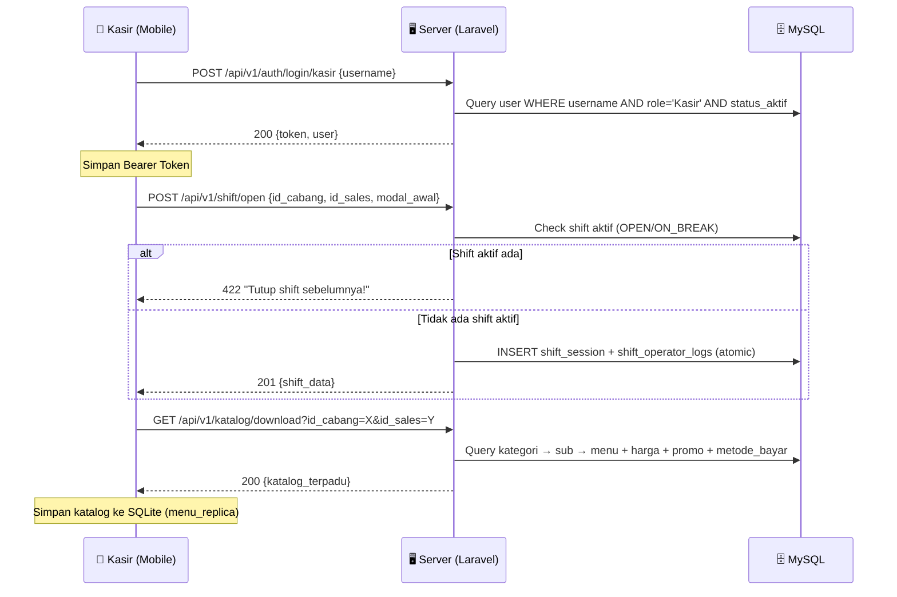
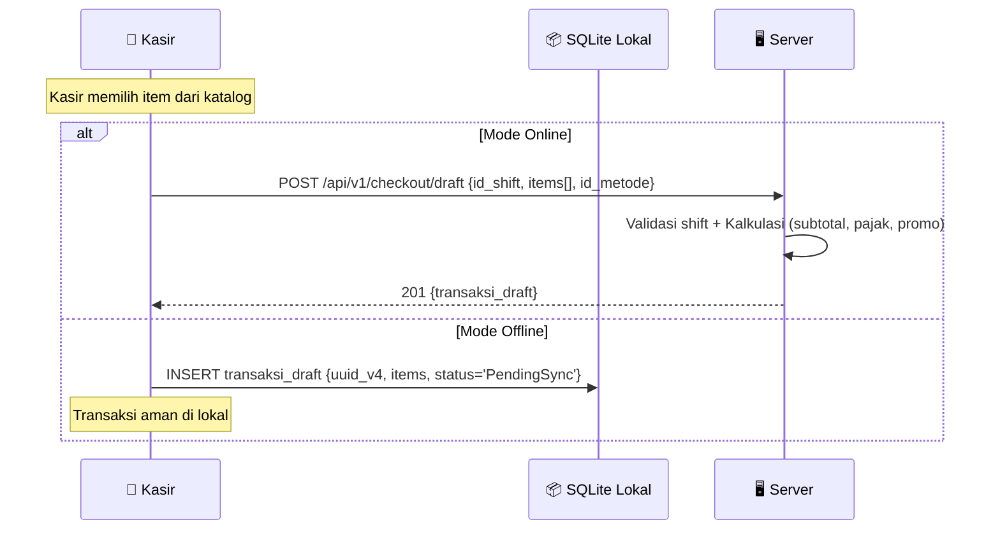
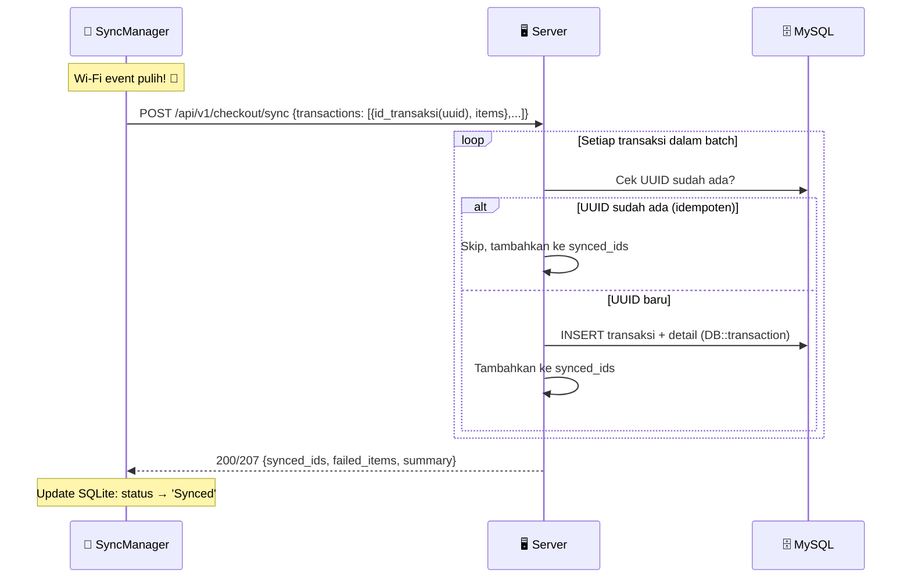
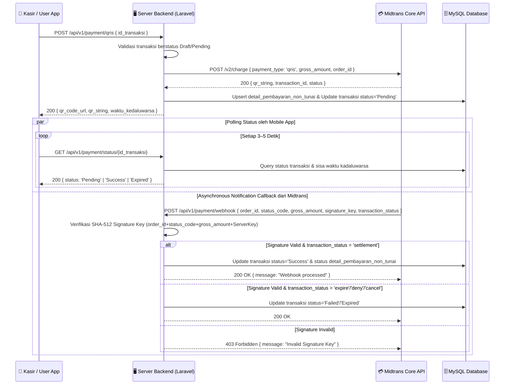

# 📋 PRODUCT REQUIREMENT DOCUMENT (PRD)
## Sistem POS Event — Multi-Platform Web & Mobile

> **Tipe Dokumen**: Living Document (Dinamis & Iteratif)
> **Metodologi**: Agile Scrum — Sprint-based Delivery

---

## 1. DOKUMEN HEADER & VERSION CONTROL

| Field | Detail |
|---|---|
| **Nama Produk** | Sistem POS Event (Point of Sale Multi-Platform) |
| **Versi PRD** | `v1.1-Sprint2` |
| **Tanggal Update** | 22 Juli 2026 |
| **Penulis / TPM** | Lead Technical Product Manager (AI-Assisted) |
| **Tech Stack Backend** | Laravel v11, Sanctum, Midtrans Core API, MySQL, Vite |
| **Tech Stack Mobile** | React Native 0.86, TypeScript 5.8, SQLite |
| **Repository** | `ikoks/Pengembangan-Aplikasi-Point-Of-Sale-untuk-Event` |

### 📝 Tabel Riwayat Perubahan (Changelog)

| Versi | Tanggal | Penulis | Deskripsi Perubahan |
|---|---|---|---|
| `v1.1-Sprint2` | 22 Jul 2026 | TPM (AI) | Integrasi Midtrans QRIS Dinamis & Status Polling (`POS-10A`), Receiver Webhook Callback dengan SHA-512 Signature verification (`POS-11`), API Katalog Terpadu Single-Download (`POS-6A`), API Batch Offline Sync Idempoten (`POS-6B`), API Draft Checkout (`POS-5A`), dan konfigurasi CORS LAN Wi-Fi. |
| `v1.0-Sprint1` | 21 Jul 2026 | TPM (AI) | Inisialisasi PRD dari SRS/SDD + audit kode sumber aktual. Mapping 28 fitur ke status implementasi nyata. |
| `v0.9-Draft` | 17 Jul 2026 | Tim Dev | Scaffolding awal proyek Laravel + React Native. 20 migrasi database + 13 cabang terdaftar. |

---

## 2. RINGKASAN PRODUK & VISI

### 2.1 Problem Statement

Penyelenggaraan festival dan event kuliner besar menghadapi tiga tantangan operasional kritis:

1. **Koneksi Internet Fluktuatif** — Lokasi event outdoor (taman, lapangan, hall) jarang memiliki infrastruktur jaringan stabil. Wi-Fi event seringkali *overloaded* oleh ribuan pengunjung, menyebabkan koneksi intermittent yang membuat sistem POS konvensional (cloud-dependent) lumpuh.

2. **Antrean Pengunjung Mengular** — Proses order manual atau POS lambat memperpanjang waktu layanan per pelanggan. Di jam puncak, hal ini menurunkan revenue potensial dan customer experience secara signifikan.

3. **Multi-Cabang & Multi-Brand** — Satu operator event dapat mengelola belasan booth/cabang dengan brand berbeda (contoh: *Let's Go Gelato*, *Terve Chocolate*, *Papyrus Photo*) di berbagai lokasi kota. Setiap cabang memiliki **harga regional** dan **konfigurasi pajak** yang berbeda-beda.

### 2.2 Visi Solusi

**POS Event** adalah sistem kasir multi-platform yang dirancang khusus untuk lingkungan event dengan kapabilitas **Offline-First Architecture**:

```
┌─────────────────────────────────────────────────────────────────┐
│                    ARSITEKTUR OFFLINE-FIRST                      │
├─────────────────────────────────────────────────────────────────┤
│                                                                 │
│   📱 HP Kasir (React Native APK)                                │
│   ├── SQLite Local DB (posevent.db)                             │
│   │   ├── menu_replica    → Cache katalog offline               │
│   │   └── transaksi_draft → Buffer transaksi pending            │
│   ├── UUID v4 Generation  → ID unik tanpa server               │
│   └── SyncManager         → Auto-sync saat Wi-Fi pulih          │
│                                                                 │
│           ↕ Wi-Fi Event (Intermittent)                          │
│                                                                 │
│   🖥️ Server Backend (Laravel + Sanctum)                         │
│   ├── MySQL (pos_event_db)  → Source of truth                   │
│   ├── Idempotent Sync API   → Deduplikasi UUID otomatis         │
│   ├── CORS 0.0.0.0          → Akses dari IP Wi-Fi lokal        │
│   └── Atomic DB Transaction → Konsistensi data terjamin         │
│                                                                 │
│   🌐 Web Admin Dashboard (Blade + Tailwind Neo-Brutalist)       │
│   └── Panel monitoring & CRUD master data via browser           │
│                                                                 │
└─────────────────────────────────────────────────────────────────┘
```

**Prinsip Utama:**
- **0% Data Loss** — Setiap transaksi disimpan di SQLite lokal HP terlebih dahulu, baru disinkronkan ke server. UUID v4 menjamin keunikan identitas tanpa ketergantungan server.
- **Single Download, Full Offline** — Satu request `GET /api/v1/katalog/download` mengunduh seluruh katalog (kategori, menu, harga regional, promosi, metode bayar) untuk mengurangi HTTP round-trip di jaringan tidak stabil.
- **Idempotent Sync** — Endpoint `POST /api/v1/checkout/sync` bersifat idempoten; UUID yang sudah ada di server tidak akan diduplikasi, sehingga aman untuk retry berkali-kali.

---

## 3. USER PERSONAS & ATURAN HAK AKSES (RBAC)

### 3.1 Persona: Kasir Lapangan (Mobile APK)

| Aspek | Detail |
|---|---|
| **Platform** | Aplikasi Mobile Android (React Native APK) |
| **Autentikasi** | Username-only login → Bearer Token via Sanctum (`POST /api/v1/auth/login/kasir`) |
| **Kebijakan Sesi** | One-device policy — token lama dihapus saat login baru |
| **Hak Akses API** | `auth:sanctum` (tanpa `admin.only`) |

**Tanggung Jawab Operasional:**

| Aksi | Endpoint / Mekanisme | Status |
|---|---|---|
| Login ke terminal kasir | `POST /api/v1/auth/login/kasir` | ✅ DONE |
| Membuka shift & set modal awal | `POST /api/v1/shift/open` | ✅ DONE |
| Mengunduh katalog offline | `GET /api/v1/katalog/download` | ✅ DONE |
| Membuat draft transaksi | `POST /api/v1/checkout/draft` | ✅ DONE |
| Sinkronisasi batch offline | `POST /api/v1/checkout/sync` | ✅ DONE |
| Jeda shift (ON_BREAK) | `POST /api/v1/shift/break` | 🔲 BACKLOG |
| Menutup shift & rekonsiliasi | `POST /api/v1/shift/close` | 🔲 BACKLOG |
| Switch operator kasir | `POST /api/v1/shift/switch` | 🔲 BACKLOG |
| Cetak struk Bluetooth | ESC/POS Printer Library | 🔲 BACKLOG |
| Logout dari terminal | `POST /api/v1/auth/logout/kasir` | ✅ DONE |

### 3.2 Persona: Admin Event / Supervisor (Web Dashboard)

| Aspek | Detail |
|---|---|
| **Platform** | Web Browser — Panel Admin (Blade + Tailwind CSS) |
| **Autentikasi** | Username + Password → Laravel Web Guard Session |
| **Hak Akses Web** | Middleware `auth` (session-based) |
| **Hak Akses API** | `auth:sanctum` + middleware `admin.only` (`EnsureUserIsAdmin`) |

**Tanggung Jawab Pengelolaan:**

| Aksi | Endpoint / View | Status |
|---|---|---|
| Login ke panel admin | `GET/POST /admin/login` | ✅ DONE |
| Melihat dashboard utama | `GET /admin/dashboard` | ⚠️ PARTIAL (placeholder) |
| CRUD Master Data Cabang | `GET/POST/PATCH/DELETE /api/v1/cabang` | ✅ DONE (API) |
| CRUD Master Data User/Kasir | `GET/POST/PATCH/DELETE /api/v1/users` | ✅ DONE (API) |
| CRUD Master Data Kategori | `GET/POST/PATCH/DELETE /api/v1/kategoris` | ✅ DONE (API) |
| CRUD Master Data Sub-Kategori | `GET/POST/PATCH/DELETE /api/v1/sub-kategoris` | ✅ DONE (API) |
| CRUD Master Data Menu | `GET/POST/PATCH/DELETE /api/v1/menus` | ✅ DONE (API) |
| Konfigurasi Harga Regional | `GET/POST/PUT/DELETE /api/v1/menu-templates` | ✅ DONE (API) |
| UI Kelola Menu & Harga (Web) | Blade View | 🔲 BACKLOG |
| UI Kelola Kasir (Web) | Blade View | 🔲 BACKLOG |
| UI Riwayat Transaksi (Web) | Blade View + API | 🔲 BACKLOG |
| UI Laporan Keuangan (Web) | Blade View + API | 🔲 BACKLOG |
| Audit trail & log aktivitas | `audit_logs` table | 🔲 BACKLOG |

### 3.3 Struktur RBAC (Role-Based Access Control)

```
┌──────────────────────────────────────────────────────────────┐
│                      RBAC MATRIX                              │
├──────────────┬───────────────────────┬───────────────────────┤
│ Resource     │ Admin                 │ Kasir                 │
├──────────────┼───────────────────────┼───────────────────────┤
│ Master Data  │ CRUD (full)           │ Read-only             │
│ Menu Template│ CRUD (full)           │ Read-only (via katalog│
│ Shift Session│ Read/Monitor          │ Open/Break/Close      │
│ Transaksi    │ Read/Void/Report      │ Create Draft/Sync     │
│ Laporan      │ Generate/Export       │ ✗ Tidak Ada Akses     │
│ Audit Log    │ Read                  │ ✗ Tidak Ada Akses     │
│ Web Dashboard│ Full Access           │ ✗ Tidak Ada Akses     │
│ Mobile APK   │ ✗ Tidak Dirancang     │ Full Access           │
└──────────────┴───────────────────────┴───────────────────────┘
```

> [!IMPORTANT]
> Middleware `admin.only` (`EnsureUserIsAdmin`) hanya mengecek `nama_role === 'Admin'`. Kasir yang memaksa mengakses endpoint write master data akan mendapat response **403 Forbidden**.

---

## 4. MATRIKS FITUR & STATUS IMPLEMENTASI NYATA (LIVE FEATURE TRACKER)

> [!NOTE]
> Status di bawah ini di-audit langsung dari kode sumber proyek per tanggal **21 Juli 2026**. Bukan berdasarkan klaim atau rencana, melainkan bukti file controller, model, migration, dan view yang sudah ada.

### 4.1 Backend RESTful API (Laravel + Sanctum)

| ID Fitur | Nama Fitur | Platform | Status | Catatan Implementasi |
|---|---|---|---|---|
| `POS-1A` | Autentikasi Admin (Web Session) | Web | ✅ **DONE** | `WebAuthController` + Blade login.blade.php. Session driver: database. Guard: web. |
| `POS-1B` | Login Kasir Lapangan (API Token) | API | ✅ **DONE** | `ApiAuthController@loginKasir`. Sanctum Bearer Token, one-device policy (token lama dihapus). Validasi role='Kasir' + status_aktif. |
| `POS-1C` | Logout Kasir (Token Revoke) | API | ✅ **DONE** | `ApiAuthController@logoutKasir`. Hanya token aktif saat ini yang dihapus. |
| `POS-2A` | CRUD Cabang (Master Data) | API | ✅ **DONE** | `CabangController` — index, show, store, update, destroy. Soft deletes aktif. Middleware: `admin.only` untuk write. |
| `POS-2B` | CRUD User/Kasir (Master Data) | API | ✅ **DONE** | `UserController` — 5 endpoint CRUD. Relasi eager-load role & cabang. |
| `POS-2C` | CRUD Kategori (Master Data) | API | ✅ **DONE** | `KategoriController` — 5 endpoint CRUD + soft deletes. |
| `POS-2D` | CRUD Sub-Kategori (Master Data) | API | ✅ **DONE** | `SubKategoriController` — 5 endpoint CRUD + soft deletes. |
| `POS-2E` | CRUD Menu/Produk (Master Data) | API | ✅ **DONE** | `MenuController` — 5 endpoint CRUD + soft deletes. |
| `POS-3A` | Harga Regional (Menu Template) | API | ✅ **DONE** | `MenuTemplateController` — store, update, destroy + getByCabang. Unique constraint per (id_menu, id_cabang, id_sales). |
| `POS-3B` | Profil User Aktif (/me) | API | ✅ **DONE** | Inline route closure di api.php. Eager-load role + cabang. |
| `POS-4A` | Opening Shift Kasir | API | ✅ **DONE** | `ShiftSessionController@open`. Active-shift guard (cek OPEN/ON_BREAK), DB::transaction atomic, audit log via ShiftOperatorLog. |
| `POS-4B` | Closing Shift Kasir | API | 🔲 **BACKLOG** | Endpoint `POST /shift/close` tercantum di docblock SDD. Controller method belum dibuat. |
| `POS-4C` | Jeda Shift (Break/Resume) | API | 🔲 **BACKLOG** | Endpoint `POST /shift/break` & `/resume` direncanakan. Belum diimplementasikan. |
| `POS-4D` | Switch Operator Kasir | API | 🔲 **BACKLOG** | Endpoint `POST /shift/switch` direncanakan. Kolom `id_user_aktif` sudah tersedia di model & migration. |
| `POS-5A` | Draft Checkout Transaksi | API | ✅ **DONE** | `CheckoutController@storeDraft`. Kalkulasi pajak/promo otomatis, fallback harga dari menu_template, DB::transaction atomic. Status awal: 'Draft'. |
| `POS-5B` | Konfirmasi Transaksi → Success | API | 🔲 **BACKLOG** | Endpoint `POST /checkout/{id}/confirm` tercantum di docblock. Belum dibuat. |
| `POS-5C` | Void/Cancel Transaksi | API | 🔲 **BACKLOG** | Endpoint `POST /checkout/{id}/void` tercantum di docblock. Kolom `alasan_batal`, `status` enum sudah tersedia di migration. |
| `POS-5D` | Riwayat Transaksi (API List) | API | 🔲 **BACKLOG** | Endpoint `GET /transaksi` tercantum di docblock. Belum dibuat. |
| `POS-6A` | Download Katalog Terpadu | API | ✅ **DONE** | `KatalogController@download`. Single-request payload: cabang, sales mode, hierarki kategori→sub→menu+harga, promosi, metode bayar. N+1 prevention via pre-fetch hargaMap. |
| `POS-6B` | Batch Offline Sync (Idempoten) | API | ✅ **DONE** | `SyncController@syncBatch`. Proses per-transaksi independen, idempotency check via UUID, HTTP 207 Multi-Status untuk partial success, error isolation. |
| `POS-10A` | Payment Gateway (QRIS Generator & Polling) | API | ✅ **DONE** | `PaymentController@generateQris` & `cekStatus`. Integrasi Midtrans Core API `/v2/charge`. Upsert model `DetailPembayaranNonTunai` & update status transaksi `Pending`. |
| `POS-11` | Payment Gateway Webhook Receiver | API | ✅ **DONE** | `PaymentController@webhook`. SHA-512 signature verification (`order_id + status_code + gross_amount + ServerKey`), auto status handler (`settlement`, `pending`, `expire`, `deny`, `cancel`). Public route tanpa CSRF/Auth. |

### 4.2 Antarmuka Web Admin (Blade Views)

| ID Fitur | Nama Fitur | Platform | Status | Catatan Implementasi |
|---|---|---|---|---|
| `WEB-1A` | Halaman Login Admin | Web | ✅ **DONE** | Neo-Brutalist Monokrom: Space Grotesk font, `#F5F0E8` krem background, grid texture, brutal box-shadow `4px 4px 0px`, animasi slideUp, toggle password visibility. |
| `WEB-1B` | Halaman Dashboard Utama | Web | ⚠️ **PARTIAL** | Blade template tersedia (`dashboard.blade.php`) tapi hanya berisi placeholder "Selamat Datang! 👋" + navbar dengan logout. Belum ada widget statistik, grafik, atau data real-time. |
| `WEB-2A` | UI Kelola Menu & Harga | Web | 🔲 **BACKLOG** | Mockup tersedia (`Kelola Menu (Admin).png`). API backend sudah ready. UI Blade belum dibuat. |
| `WEB-2B` | UI Kelola Kasir/User | Web | 🔲 **BACKLOG** | Mockup tersedia (`Kelola Kasir (Admin).png`, `Kelola Admin (Admin).png`). API backend sudah ready. |
| `WEB-2C` | UI Riwayat Transaksi | Web | 🔲 **BACKLOG** | Mockup tersedia (`Riwayat Transaksi (Admin).png`). API list transaksi juga belum dibuat. |
| `WEB-2D` | UI Laporan Keuangan | Web | 🔲 **BACKLOG** | Mockup tersedia (`Generate Laporan (Admin).png`). Backend API belum tersedia. |
| `WEB-2E` | UI Lupa Password | Web | 🔲 **BACKLOG** | Mockup tersedia (`Lupa Password (Admin).png`). Link "Lupa Password?" di login mengarah ke `#`. |
| `WEB-2F` | UI Registrasi Admin | Web | 🔲 **BACKLOG** | Mockup tersedia. Belum ada endpoint maupun view. |

### 4.3 Aplikasi Mobile Kasir (React Native)

| ID Fitur | Nama Fitur | Platform | Status | Catatan Implementasi |
|---|---|---|---|---|
| `MOB-1A` | Login Screen Kasir | Mobile | ✅ **DONE** | Neo-Brutalist UI: sharp 4px border, offset shadow, `SYS_AUTH_V1.0` header, live character count. HTTP login ke API dengan offline fallback alert (`⚠️ TERMINAL OFFLINE`). |
| `MOB-1B` | Opening Shift Screen | Mobile | ✅ **DONE** | ScrollView Neo-Brutalist: 13 cabang hardcoded (3 brand), pill button branch/mode selector, currency input Rp. SQLite init via `useEffect`. Offline fallback (`⚠️ SHIFT LURING`). |
| `MOB-2A` | POS Main Screen (Katalog & Checkout) | Mobile | 🔲 **BACKLOG** | State `'POS_MAIN'` terdefinisi di `App.tsx` tapi hanya menampilkan info sesi kasir placeholder. Grid katalog menu, keranjang, dan pembayaran belum diimplementasi. |
| `MOB-2B` | Pembayaran Tunai Screen | Mobile | 🔲 **BACKLOG** | Mockup tersedia (`Pembayaran Tunai (Kasir).png`). |
| `MOB-2C` | Pembayaran Non-Tunai Screen | Mobile | 🔲 **BACKLOG** | Mockup tersedia (`Pembayaran Non-Tunai (Kasir).png`). |
| `MOB-3A` | Pengaturan / Konfigurasi Printer | Mobile | 🔲 **BACKLOG** | Mockup tersedia (`Pengaturan (Kasir).png`). Library `react-native-bluetooth-escpos-printer` sudah terinstall di `package.json`. |
| `MOB-3B` | Closing Shift Screen | Mobile | 🔲 **BACKLOG** | Mockup tersedia (`Closing (Kasir).png`). |
| `MOB-3C` | Switch Operator Screen | Mobile | 🔲 **BACKLOG** | Mockup tersedia (`Switch (Kasir).png`). |

### 4.4 Database & Infrastruktur

| ID Fitur | Nama Fitur | Platform | Status | Catatan Implementasi |
|---|---|---|---|---|
| `DB-1A` | Schema Migration (20 tabel) | Backend | ✅ **DONE** | 20 file migration: personal_access_tokens, role_user, cabang, sales_mode, kategori, metode_pembayaran, user, sub_kategori, menu, menu_template, promosi, shift_session, transaksi, transaksi_detail, detail_pembayaran_non_tunai, shift_operator_logs, audit_logs, sessions, soft_deletes, unique constraints. |
| `DB-1B` | Soft Deletes pada Master Tables | Backend | ✅ **DONE** | Migration `add_soft_deletes_to_master_tables` menambah `deleted_at` ke tabel cabang, kategori, sub_kategori, menu, user. |
| `DB-1C` | UUID Trait (HasUuid) | Backend | ✅ **DONE** | Custom trait `HasUuid` digunakan oleh `Transaksi`, `ShiftSession`, dan model lain. Auto-generate UUID v4 jika tidak disediakan. |
| `DB-1D` | SQLite Offline Schema (Mobile) | Mobile | ✅ **DONE** | `posevent.db` dengan tabel `menu_replica` (cache katalog) dan `transaksi_draft` (buffer offline). Driver: `react-native-sqlite-storage`. |
| `DB-1E` | CORS Wi-Fi Lokal | Backend | ✅ **DONE** | `config/cors.php` dengan `supports_credentials = true` & middleware `HandleCors` global di `bootstrap/app.php` untuk fleksibilitas akses LAN Wi-Fi event. |
| `DB-1F` | Payment Gateway Config & Model | Backend | ✅ **DONE** | Model `DetailPembayaranNonTunai`, relasi `hasOne` pada `Transaksi`, `config/midtrans.php` terintegrasi dengan environment variables (`MIDTRANS_SERVER_KEY`, `MIDTRANS_CLIENT_KEY`, `MIDTRANS_IS_PRODUCTION`, `MIDTRANS_EXPIRY_DURATION`). |

### 4.5 Ringkasan Progress

```
╔════════════════════════════════════════════════════════════╗
║               RINGKASAN STATUS IMPLEMENTASI                ║
╠════════════════════════╦═══════╦═══════════╦══════════════╣
║ Komponen               ║ DONE  ║ PARTIAL   ║ BACKLOG      ║
╠════════════════════════╬═══════╬═══════════╬══════════════╣
║ Backend API (Laravel)  ║  15   ║     0     ║      6       ║
║ Web Admin (Blade)      ║   1   ║     1     ║      6       ║
║ Mobile Kasir (RN)      ║   2   ║     0     ║      6       ║
║ Database/Infra         ║   6   ║     0     ║      0       ║
╠════════════════════════╬═══════╬═══════════╬══════════════╣
║ TOTAL                  ║  24   ║     1     ║     18       ║
╚════════════════════════╩═══════╩═══════════╩══════════════╝

  █████████████████░░░░░░░░░░░░  Overall Progress: ~57%
  ███████████████████████░░░░░░  Backend API:       ~71%  
  ██████░░░░░░░░░░░░░░░░░░░░░░  Web Admin UI:      ~19%
  ██████░░░░░░░░░░░░░░░░░░░░░░  Mobile Kasir:      ~25%
  █████████████████████████████  Database/Infra:    100%
```

---

## 5. SPESIFIKASI ALUR PENGGUNA & ANTARMUKA

### 5.1 Panduan Gaya Visual

#### Web Admin — Neo-Brutalist Monokrom

| Elemen | Spesifikasi |
|---|---|
| **Font Utama** | Space Grotesk (Google Fonts) — wght 400–800 |
| **Background** | `#F5F0E8` (krem hangat) + grid texture `32px × 32px` |
| **Border** | `4px solid #0A0A0A` (hitam tegas, tanpa radius) |
| **Shadow** | `4px 4px 0px 0px #000000` (flat, tanpa blur — ciri Neo-Brutalism) |
| **Aksen Warna** | `#c77dff` (brutal-purple) |
| **Animasi** | `slideUp 0.4s ease-out` (card muncul), `translate(4px,4px)` saat tombol ditekan |
| **Input Focus** | Shadow muncul + transform translate `-2px,-2px` |

#### Mobile Kasir — Compact Grid Layout (Neo-Brutalist Variant)

| Elemen | Spesifikasi |
|---|---|
| **Font** | System font (React Native default) |
| **Border** | `4px solid #1A1A2E` (dark navy) |
| **Shadow** | Backplate offset shadow `3px 3px` |
| **Layout** | ScrollView dengan pill buttons untuk seleksi cabang/mode |
| **Color Scheme** | Dark background `#1A1A2E`, accent `#E94560` |
| **Window Decorations** | Terminal-style header (`SYS_AUTH_V1.0`, `SYS_SHIFT_INIT`) |

### 5.2 Alur Kerja Utama

#### Alur 1: Login & Opening Shift (✅ Implemented)



#### Alur 2: Transaksi & Checkout (✅ API Done, 🔲 Mobile UI Backlog)



#### Alur 3: Sinkronisasi Offline → Online (✅ Implemented)



#### Alur 4: Closing Shift & Rekonsiliasi (🔲 BACKLOG)

```
1. Kasir menekan tombol "Tutup Shift"
2. Sistem menampilkan ringkasan penjualan selama shift
3. Kasir menginput jumlah uang fisik di laci kas
4. Sistem menghitung selisih (ekspektasi vs fisik)
5. Data disimpan: uang_fisik_akhir, selisih_uang, waktu_selesai
6. Status shift → 'CLOSED'
7. Log audit dicatat di shift_operator_logs
```

#### Alur 5: Pembayaran Non-Tunai Dinamis QRIS & Midtrans Webhook Callback (✅ Implemented)



### 5.3 Mockup UI yang Tersedia

Berikut daftar mockup dari folder `Dokumen/Mokup/` yang menjadi acuan pengembangan:

| # | File Mockup | Target Platform | Status Implementasi |
|---|---|---|---|
| 1 | `Login (Admin).png` | Web | ✅ DONE |
| 2 | `Dashboard (Admin).png` | Web | ⚠️ PARTIAL |
| 3 | `Kelola Menu (Admin).png` | Web | 🔲 BACKLOG |
| 4 | `Kelola Kasir (Admin).png` | Web | 🔲 BACKLOG |
| 5 | `Kelola Admin (Admin).png` | Web | 🔲 BACKLOG |
| 6 | `Riwayat Transaksi (Admin).png` | Web | 🔲 BACKLOG |
| 7 | `Generate Laporan (Admin).png` | Web | 🔲 BACKLOG |
| 8 | `Lupa Password (Admin).png` | Web | 🔲 BACKLOG |
| 9 | `Login (Kasir).png` | Mobile | ✅ DONE |
| 10 | `Menu (Kasir).png` | Mobile | 🔲 BACKLOG |
| 11 | `Pembayaran Tunai (Kasir).png` | Mobile | 🔲 BACKLOG |
| 12 | `Pembayaran Non-Tunai (Kasir).png` | Mobile | 🔲 BACKLOG |
| 13 | `Pengaturan (Kasir).png` | Mobile | 🔲 BACKLOG |
| 14 | `Closing (Kasir).png` | Mobile | 🔲 BACKLOG |
| 15 | `Switch (Kasir).png` | Mobile | 🔲 BACKLOG |

---

## 6. METRIK KEBERHASILAN (KPIs) & KEBUTUHAN NON-FUNGSIONAL

### 6.1 Key Performance Indicators (KPIs)

| # | KPI | Target | Metode Pengukuran | Status Tooling |
|---|---|---|---|---|
| 1 | **Response Time API** | < 500ms (p95) | Laravel Telescope / API gateway log | 🔲 Belum setup |
| 2 | **Response Time UI Web** | < 2 detik (first meaningful paint) | Lighthouse audit | 🔲 Belum setup |
| 3 | **Server Uptime** | ≥ 99.5% | Uptime monitoring (UptimeRobot / Pingdom) | 🔲 Belum setup |
| 4 | **Kecepatan Cetak Bluetooth** | < 3 detik per struk | Manual measurement di field | 🔲 Printer belum terintegrasi |
| 5 | **Data Loss Rate (Offline-Sync)** | 0% | `failed_items.count === 0` pada sync response | ✅ Mekanisme tersedia |
| 6 | **Sync Latency** | < 30 detik setelah Wi-Fi pulih | SyncManager timer | 🔲 SyncManager belum dibuat |
| 7 | **Transaksi per Menit** | ≥ 3 transaksi/menit/kasir | Dashboard metrics | 🔲 Dashboard belum ready |
| 8 | **Akurasi Rekonsiliasi Kas** | Selisih < Rp 5.000 | `selisih_uang` pada closing shift | 🔲 Closing belum dibuat |

### 6.2 Kebutuhan Non-Fungsional

| Kategori | Requirement | Spesifikasi Teknis | Status |
|---|---|---|---|
| **Keamanan** | Token expiry & revocation | Sanctum token, one-device policy, revoke on logout | ✅ DONE |
| **Keamanan** | RBAC enforcement | Middleware `admin.only` + role check per endpoint | ✅ DONE |
| **Keamanan** | Password hashing | Bcrypt 12 rounds (`BCRYPT_ROUNDS=12`) | ✅ DONE |
| **Keamanan** | CSRF Protection | Laravel CSRF token pada form web | ✅ DONE |
| **Reliability** | Atomic transactions | `DB::transaction` di checkout, shift, sync | ✅ DONE |
| **Reliability** | Idempotency | UUID check sebelum insert di SyncController | ✅ DONE |
| **Reliability** | Soft deletes | `deleted_at` pada master tables (cabang, user, kategori, sub_kategori, menu) | ✅ DONE |
| **Scalability** | N+1 prevention | Eager-loading + pre-fetch hargaMap di KatalogController | ✅ DONE |
| **Usability** | Offline-first operation | SQLite buffer + UUID v4 client-side generation | ✅ DONE (partial) |
| **Compatibility** | Multi-device Wi-Fi | CORS `0.0.0.0`, APP_URL IP lokal `192.168.x.x` | ✅ DONE |
| **Audit** | Shift audit trail | `shift_operator_logs` + `audit_logs` tables | ✅ Schema ready |

---

## 7. ANALISIS RISIKO & MATRIKS MITIGASI

### 7.1 Risk Assessment Matrix

| # | Risiko | Probabilitas | Dampak | Severity | Mitigasi Teknis | Status Mitigasi |
|---|---|---|---|---|---|---|
| **R-01** | **Kegagalan Jaringan Wi-Fi Event** — Koneksi putus saat jam puncak pengunjung, kasir tidak bisa checkout. | 🔴 Tinggi | 🔴 Kritis | **CRITICAL** | SQLite buffer offline + UUID v4 client-side + `SyncManager` auto-retry + `POST /checkout/sync` idempoten. | ✅ Mekanisme API ready. ⚠️ SyncManager mobile belum auto-trigger. |
| **R-02** | **Bluetooth Printer Terputus** — Koneksi Bluetooth tidak stabil, struk gagal dicetak. | 🟡 Sedang | 🟡 Sedang | **HIGH** | Re-connect mechanism di library ESC/POS + opsi "Cetak Ulang Struk" + fallback tampilkan struk digital di layar. | 🔲 Printer integration belum dimulai. Library sudah terinstall. |
| **R-03** | **Kecurangan Void/Cancel** — Kasir melakukan void transaksi tanpa alasan valid untuk menutupi selisih kas. | 🟡 Sedang | 🔴 Kritis | **HIGH** | Kolom `alasan_batal` wajib diisi + `diperbarui_oleh` mencatat pelaku + audit log + supervisor approval flow. | ⚠️ Schema DB ready. Logic approval belum diimplementasi. |
| **R-04** | **Duplikasi Transaksi Saat Sync** — SyncManager mengirim ulang transaksi yang sudah ada di server. | 🟡 Sedang | 🟡 Sedang | **MEDIUM** | Idempotency check di `SyncController` — cek `Transaksi::where('id_transaksi', $uuid)` sebelum insert. UUID yang sudah ada langsung masuk `synced_ids`. | ✅ **DONE** |
| **R-05** | **Selisih Kas Saat Closing** — Uang fisik tidak cocok dengan total transaksi di sistem. | 🟡 Sedang | 🟡 Sedang | **MEDIUM** | Kolom `uang_fisik_akhir`, `selisih_uang` di `shift_session`. Alert jika selisih > threshold. Laporan per-shift. | ⚠️ Schema ready, logic belum dibuat. |
| **R-06** | **Harga Tidak Konsisten Antar Platform** — Harga di HP kasir berbeda dengan di server karena cache kadaluarsa. | 🟢 Rendah | 🟡 Sedang | **MEDIUM** | Katalog di-download ulang setiap opening shift baru (`GET /katalog/download`). Fallback harga dari `menu_template` di server saat checkout/sync. | ✅ **DONE** |
| **R-07** | **Concurrent Shift Opening** — Dua device kasir mencoba membuka shift bersamaan. | 🟢 Rendah | 🟡 Sedang | **LOW** | Active-shift guard di `ShiftSessionController@open` — cek `whereIn('status_shift', ['OPEN','ON_BREAK'])` sebelum create. | ✅ **DONE** |
| **R-08** | **Data Loss pada HP Kasir** — Perangkat mati / factory reset sebelum sync. | 🟢 Rendah | 🔴 Kritis | **HIGH** | SQLite persistence di internal storage (bukan cache). Rekomendasi: sync setiap 5 menit saat online. | ⚠️ Auto-sync interval belum diimplementasi. |
| **R-09** | **Pemalsuan Webhook Payment (Signature Tampering)** — Pihak ketiga menembak endpoint webhook dengan notifikasi pembayaran palsu. | 🟡 Sedang | 🔴 Kritis | **HIGH** | Verifikasi SHA-512 Signature Key pada `PaymentController@webhook`: `hash('sha512', order_id + status_code + gross_amount + ServerKey)`. Mismatch langsung ditolak (HTTP 403). | ✅ **DONE** |

### 7.2 Risk Severity Heatmap

```
        Dampak →   Rendah    Sedang    Kritis
Probabilitas ↓  ┌─────────┬─────────┬─────────┐
    Tinggi       │         │         │  R-01   │
                 ├─────────┼─────────┼─────────┤
    Sedang       │         │  R-04   │ R-02    │
                 │         │  R-05   │ R-03    │
                 ├─────────┼─────────┼─────────┤
    Rendah       │         │  R-06   │ R-08    │
                 │         │  R-07   │         │
                 └─────────┴─────────┴─────────┘
```

---

## 8. RENCANA RILIS & DEPLOYMENT (ROLLOUT PLAN)

### 8.1 Fase Rilis

| Fase | Nama | Durasi | Scope | Kriteria Exit |
|---|---|---|---|---|
| **Fase 1** | 🔧 **Alpha (Staging Lokal)** | Sprint 1–2 | API backend lengkap + Mobile login/shift + Web login | Semua endpoint API teruji via Postman. Login Web & Mobile berfungsi. SQLite write terbukti. |
| **Fase 2** | 🧪 **Beta (Sandbox QRIS)** | Sprint 3 | Integrasi payment gateway sandbox + UI checkout mobile + cetak struk Bluetooth | Pembayaran non-tunai sandbox berhasil. Struk Bluetooth tercetak < 3 detik. |
| **Fase 3** | 🎭 **Dry Run (Simulasi Festival)** | Sprint 4 | Full end-to-end test di lingkungan mirip event + stress test jaringan | 50+ transaksi simultan tanpa data loss. Offline-sync 100% berhasil. Closing shift balance. |
| **Fase 4** | 🚀 **Go-Live (Event Nyata)** | Sprint 5+ | Deployment production + monitoring real-time + support on-site | Event pertama berjalan lancar. Dashboard admin menampilkan data real-time. |

### 8.2 Sprint Backlog Prioritas (Rekomendasi)

#### Sprint 2 — Core Transaction Flow

| Prioritas | Item | Platform |
|---|---|---|
| P0 | Closing Shift API (`/shift/close`) | API |
| P0 | Konfirmasi Transaksi API (`/checkout/{id}/confirm`) | API |
| P0 | POS Main Screen — Grid Katalog & Keranjang | Mobile |
| P1 | Pembayaran Tunai Screen | Mobile |
| P1 | Void/Cancel Transaksi API | API |
| P1 | SyncManager auto-trigger saat Wi-Fi pulih | Mobile |
| P2 | Break/Resume Shift API | API |

#### Sprint 3 — Payment & Printing

| Prioritas | Item | Platform |
|---|---|---|
| P0 | Integrasi Midtrans QRIS Dinamis (`/payment/qris` & `/status`) | API | ✅ **DONE** |
| P0 | Webhook Receiver Payment Midtrans (`/payment/webhook`) | API | ✅ **DONE** |
| P0 | Integrasi ESC/POS Bluetooth Printer | Mobile | 🔲 BACKLOG |
| P0 | UI Pembayaran Non-Tunai (QRIS Display & Polling) | Mobile | 🔲 BACKLOG |
| P1 | Web Dashboard — Widgets Statistik | Web | 🔲 BACKLOG |
| P1 | Web UI Kelola Menu & Harga | Web | 🔲 BACKLOG |
| P2 | Switch Operator Screen & API | Mobile + API | 🔲 BACKLOG |

#### Sprint 4 — Admin & Reporting

| Prioritas | Item | Platform |
|---|---|---|
| P0 | Web UI Riwayat Transaksi + List API | Web + API |
| P0 | Web UI Laporan Keuangan + Export | Web + API |
| P1 | Web UI Kelola Kasir/User | Web |
| P1 | Audit Log Viewer | Web |
| P2 | Lupa Password & Registrasi Admin | Web |

### 8.3 Deployment Architecture (Target)

```
┌──────────────────────────────────────────────────────────────┐
│                    DEPLOYMENT TOPOLOGY                        │
├──────────────────────────────────────────────────────────────┤
│                                                              │
│   ☁️ Production Server (VPS/Cloud)                           │
│   ├── Nginx Reverse Proxy                                    │
│   ├── PHP-FPM (Laravel App)                                  │
│   ├── MySQL 8.0 (pos_event_db)                               │
│   └── SSL/TLS Certificate                                    │
│                                                              │
│   📡 Wi-Fi Router Event                                      │
│   ├── SSID: POS-EVENT-{nama_event}                           │
│   ├── Subnet: 192.168.x.0/24                                │
│   └── Port Forwarding → Server                               │
│                                                              │
│   📱 HP Kasir (×N devices)                                   │
│   ├── APK: PosEventKasir.apk                                │
│   ├── SQLite: posevent.db                                    │
│   └── Bluetooth → ESC/POS Thermal Printer                    │
│                                                              │
│   💻 Laptop Admin (×1-2)                                     │
│   └── Browser → https://pos.event-domain.com/admin           │
│                                                              │
└──────────────────────────────────────────────────────────────┘
```

---

## 9. ATURAN PEMBARUAN BERKALA (LIVING DOCUMENT RULE)

> [!IMPORTANT]
> **Dokumen PRD ini bersifat dinamis (Living Document).**
>
> Setiap kali pengembang memberikan laporan commit/progress harian baru, AI akan:
>
> 1. **Memperbarui tabel Changelog** (Bab 1) — Menambah baris baru dengan versi, tanggal, dan deskripsi perubahan.
> 2. **Mengubah status fitur di Live Feature Tracker** (Bab 4) — Memindahkan status dari `🔲 BACKLOG` → `🔄 IN PROGRESS` → `✅ DONE` berdasarkan bukti kode yang di-commit.
> 3. **Memutakhirkan detail teknis** — Memperbarui catatan implementasi, endpoint baru, model baru, atau perubahan arsitektur.
> 4. **Merevisi progress bar** — Mengkalkulasi ulang persentase penyelesaian per komponen.
> 5. **Mengupdate Risk Assessment** — Mengubah status mitigasi risiko sesuai perkembangan.
>
> **Trigger pembaruan:**
> - Setiap commit/push ke repository
> - Setiap akhir sprint / daily standup
> - Setiap ada perubahan arsitektur atau keputusan teknis signifikan

---

## LAMPIRAN

### A. Daftar Dokumen Acuan

| Dokumen | Lokasi | Format |
|---|---|---|
| Software Requirements Specification (SRS) | `Dokumen/SDD dan SRS/SRS_POS_Event.pdf` | PDF + DOCX |
| Software Design Document (SDD) | `Dokumen/SDD dan SRS/SDD_POS_Event.pdf` | PDF + DOCX |
| Entity Relationship Diagram (ERD) | `Dokumen/ERD.png` | PNG |
| Class Diagram | `Dokumen/Class Diagram.png` | PNG |
| Deployment Diagram | `Dokumen/Deployment Diagram.png` | PNG |
| Use Case Diagram | `Dokumen/UseCase.png` | PNG |
| Use Case Scenario | `Dokumen/Usecase Scenario.xlsx` | XLSX |
| Physical Database Design | `Dokumen/Physical Design (Database).xlsx` | XLSX |
| Perancangan Sistem | `Dokumen/Perancangan.pdf` | PDF |

### B. Daftar Diagram UML Tersedia

| Tipe Diagram | Jumlah File | Contoh |
|---|---|---|
| Activity Diagram | 13 | Login, TransaksiPenjualan, SinkronisasiData, KelolaShift |
| Sequence Diagram | 14 | Login, OpeningShift, ClosingShift, MembatalkanPesanan |
| State Diagram | 2 | Siklus Shift Session, Siklus Transaksi |

### C. Teknologi & Versi

| Komponen | Teknologi | Versi |
|---|---|---|
| Backend Framework | Laravel | v11 |
| Token Auth | Laravel Sanctum | - |
| Database Server | MySQL | 8.0 |
| Session Driver | Database | - |
| Frontend Web | Blade + Tailwind CSS (CDN) | v3 |
| Mobile Framework | React Native | 0.86.0 |
| Mobile Language | TypeScript | 5.8.3 |
| Mobile DB | react-native-sqlite-storage | 6.0.1 |
| Bluetooth Printer | react-native-bluetooth-escpos-printer | 0.0.5 |
| Package Manager (BE) | Composer | 2.x |
| Package Manager (FE) | npm | - |
| Runtime (Mobile) | Node.js | ≥ 22.11.0 |
| Build Tool (BE) | Vite | - |

---

> **Terakhir diperbarui**: 22 Juli 2026, 00:05 WIB
> **Versi PRD**: v1.1-Sprint2
> **Next review**: Akhir Sprint 2

